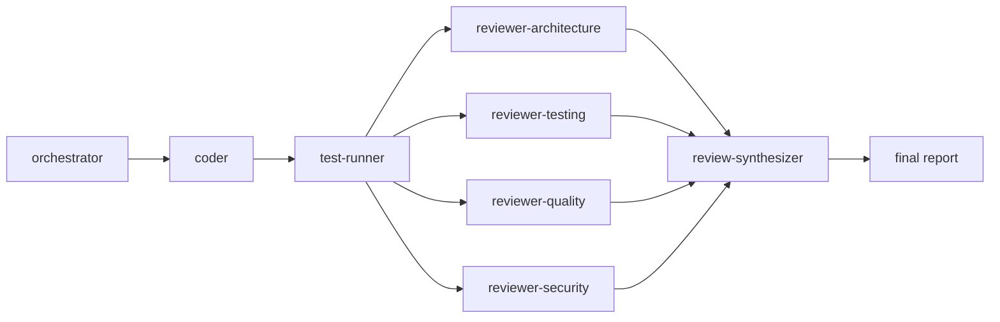

# Mindbody.AI.Orchestrator

Multi-instance Claude/Cursor orchestration platform for reliable, template-driven software
development workflows.

## The problem

Multiple developers times individual AI habits equals fragmented knowledge that never compounds,
quality that depends on who typed the prompt, effort wasted rediscovering the same prompts and
pitfalls, and a steep learning curve for every new teammate. Individuals get better at AI-assisted
development; the team does not.

## The solution

Standardize and share through one repo. Clone it, type one command, and the AI behaves the same
way for everyone:

- **Disciplined roles.** One orchestrator plans, delegates, verifies, reports. Eight specialists
  each do exactly one job. The rules live in `AGENTS.md`.
- **File-based coordination.** Agents communicate through `shared-workspace/` files with exactly
  one writer each — any human can inspect a run mid-flight.
- **Template-driven work.** PRDs, plans, and reports are instantiated from `templates/`, never
  improvised.
- **Intelligent context management.** Smart loading (locate first, read only the relevant region),
  role-based context (each agent receives only what its subtask needs), separation of concerns
  (each rule lives in exactly one file), lazy evaluation (skills and patterns load only when the
  current step needs them). The AI manages its own context; `CLAUDE.md` is a router, not a manual.



## What you get beyond vanilla Claude/Cursor

- **Multi-level instructions** — global, project, and personal layers via `AGENTS.md` +
  `CLAUDE.md` + `CLAUDE.local.md`, with precedence stated once in `AGENTS.md`.
- **Automated task breakdown** paired with a verification protocol: nothing is "done" without
  command evidence.
- **Template-driven development** backed by proven patterns (`templates/`, `patterns/dotnet/`).
- **A 95%+ test mandate** on new/changed code, gated by an independent reviewer — a coder
  claiming green is not evidence.
- **Specialized subagents with parallel execution** — four reviewers run concurrently, then a
  synthesizer merges their verdicts.
- **AI-managed context** — lazy-load tables keep every agent's working context small and relevant.

## Quick start

```
cd /path/to/Mindbody.AI.Orchestrator
claude
```

Then pick an entry point:

- **Option A — fully autonomous.** `/coordinate "Add GetUser method that retrieves user by ID"`
  does everything: breakdown, implement, test, review, report.
- **Option B — plan first.** `/ac "Add GetUser method that retrieves user by ID"` asks clarifying
  questions to build a PRD, gets your approval, then executes the same pipeline.
- **Option C — review only.** `/review` checks code quality and changes nothing.

## Watching it work

Two directories tell you everything: `ls shared-workspace/` is the current run, live;
`ls tasks/` is the history of every task ever started. A typical mid-run listing:

```
$ ls shared-workspace/
ORCHESTRATOR_CONSTRAINTS.md   # the run's law: scope, quality bar, cycle limit — immutable
CODING_PROGRESS.md            # coder's append-only journal, one entry per finished subtask
TEST_RESULTS.md               # test-runner facts: build, pass/fail counts, new-code coverage
REVIEW_ARCHITECTURE.md        # one verdict + findings table per reviewer
REVIEW_TESTING.md             #   (finding IDs prefixed A/T/Q/S by reviewer)
REVIEW_QUALITY.md
REVIEW_SECURITY.md
REVIEW_CHECKLIST.md           # synthesizer's merged verdict — the must-fix list this cycle
```

`FINAL_STATUS.md` appears exactly once, at the end. For the current phase of any task, run
`cat tasks/<id>/status.md`. Every file's schema and writer is defined in
`shared-workspace/README.md`.

## What is inside

```
.claude/
  agents/                  8 specialists: coder, test-runner, 4 reviewers, review-synthesizer,
                           doc-generator
  commands/                /coordinate, /ac, /review — the only pipeline entry points
  skills/                  task-breakdown, verification-protocol, context-management, prd-building
.cursor/
  rules/                   orchestrator.mdc — Cursor wiring (see below)
templates/                 4 fill-in templates the orchestrator instantiates (PRD, plan, ...)
patterns/
  dotnet/                  proven .NET implementation patterns, loaded only for .NET targets
shared-workspace/          live coordination files for the current run (contract in its README)
tasks/                     durable per-task records: prd.md, plan.md, status.md, verification-checklist.md, final-status.md
docs/                      adoption.md, extending.md, architecture.md — for humans, never loaded
                           during a run
AGENTS.md                  tool-neutral invariant rules, roles, and precedence
CLAUDE.md                  Claude Code wiring — imports AGENTS.md, lazy-loads everything else
CLAUDE.local.md.example    personal overrides — copy to gitignored CLAUDE.local.md
```

## Using it from Cursor

Cursor reads `AGENTS.md` natively, so the invariant rules, roles, and file contract apply
unchanged. Cursor has no subagent Task tool or slash commands, so `.cursor/rules/orchestrator.mdc`
explains how to run the command files in `.claude/commands/` as manual protocols: open the
command file for `/coordinate`, `/ac`, or `/review` and execute its steps in order, playing each
role in sequence and writing the same `shared-workspace/` files.

## Adopting it in your project

`docs/adoption.md` walks through three options:

- **Copy in** — copy the config files into your repo and set your project's quality bar.
- **Submodule** — pin this repo as a git submodule and wire your `CLAUDE.md` to it.
- **Global** — install the shared pieces user-globally and keep projects untouched.

## Extending & roadmap

Add agents, skills, patterns, or language packs by following `docs/extending.md`.
Planned for v2: lifecycle hooks, CI quality gates, more language packs under `patterns/`,
multi-instance git worktrees, and plugin packaging.

## Design decisions

Why file-based coordination, why one writer per file, why the orchestrator never codes, and the
alternatives considered: `docs/architecture.md`.
