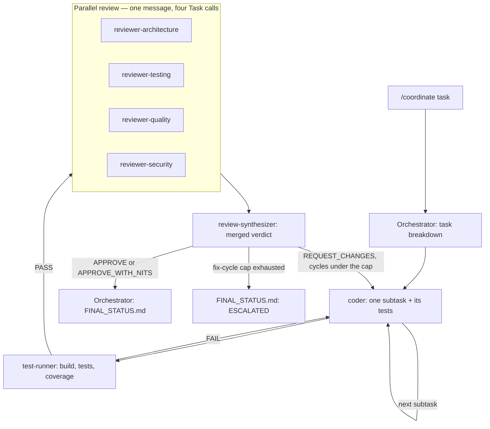

# Architecture

How this repo turns one AI coding session into a disciplined multi-agent pipeline. The rules
themselves live in `AGENTS.md` (invariants, roles, precedence) and `shared-workspace/README.md`
(file contract); this document explains the shape of the system and why it is shaped that way.
Do not load it during pipeline execution (see AGENTS.md context discipline).

## Topology

One **orchestrator** — the main Claude Code instance — and eight subagents defined in
`.claude/agents/`: coder, test-runner, reviewer-architecture, reviewer-testing, reviewer-quality,
reviewer-security, review-synthesizer, doc-generator. The orchestrator plans, delegates, verifies,
and reports; it never edits source inside a pipeline (AGENTS.md invariant rule 2). Subagents share
no conversation state with each other or with the orchestrator — every hand-off travels through a
`shared-workspace/` file with exactly one writer.

## The /coordinate pipeline



`/ac` runs the same pipeline behind a PRD and an explicit human-approval gate; `/review` runs only
the review stage and changes no source code — its only write outside `shared-workspace/` is
archiving a previous pipeline run's files into that run's task folder.

## One run, end to end

Every arrow back to the orchestrator is a file, not a message — the sequence below names the
`shared-workspace/` file each step writes (schemas in `shared-workspace/README.md`).

```mermaid
sequenceDiagram
    participant H as Human
    participant O as Orchestrator
    participant C as coder
    participant T as test-runner
    participant R as 4 reviewers
    participant S as review-synthesizer

    H->>O: /coordinate "task"
    O->>O: task-breakdown skill
    Note over O: writes ORCHESTRATOR_CONSTRAINTS.md,<br/>tasks record plan.md + status.md
    loop each subtask, sequentially
        O->>C: context packet (one subtask, "not your job" list)
        C-->>O: appends to CODING_PROGRESS.md
    end
    O->>T: run build / tests / coverage
    T-->>O: writes TEST_RESULTS.md
    par architecture
        O->>R: reviewer-architecture
    and testing
        O->>R: reviewer-testing
    and quality
        O->>R: reviewer-quality
    and security
        O->>R: reviewer-security
    end
    R-->>O: REVIEW_ARCHITECTURE.md, REVIEW_TESTING.md,<br/>REVIEW_QUALITY.md, REVIEW_SECURITY.md
    O->>S: merge the four reports
    S-->>O: writes REVIEW_CHECKLIST.md (overall verdict)
    alt REQUEST_CHANGES and cycles under the cap
        O->>C: fix blocking findings, then re-test, re-review
    end
    O->>H: writes FINAL_STATUS.md — copies it to<br/>tasks/&lt;id&gt;/final-status.md (run files archive<br/>when the next run starts)
```

## Design decisions

### Reviewers are launched by the orchestrator; the "QA coordinator" became review-synthesizer

The original sketch had a QA coordinator agent that would spawn and manage the four reviewers.
That design is impossible in Claude Code: subagents cannot spawn subagents. So the orchestrator
launches all four reviewers itself, in one message with four parallel Task calls (the CLAUDE.md
rule — a single multi-Task message is what makes them concurrent), and the coordinator became
**review-synthesizer**: a plain subagent that runs after the reviewers finish and merges their
four reports into one REVIEW_CHECKLIST.md verdict. Coordination happens after the fact, through
files, not through a manager in the loop.

### Personas live in the agent files

Each file in `.claude/agents/` opens with a persona block; there is no separate `personas/`
mechanism. Output styles — the older way to inject a persona — are effectively deprecated, and a
`personas/` directory would duplicate the agent definitions it decorates, violating the AGENTS.md
rule that each rule lives in exactly one file. The agent file is the persona.

### Single writer per file, not locking

Agents edit files via read-modify-write with no locking. Two writers on one file — even a
supposedly append-only one — will eventually both read version N and both write version N+1, and
the last write silently clobbers the first. Rather than build locking, the protocol removes the
race by construction: every coordination file has exactly one writer (the table in
`shared-workspace/README.md`). That is why the four reviewers write four files instead of one
shared report, and why CODING_PROGRESS.md is append-only *and* single-writer — append-only alone
would not save it.

### "Multi-instance" in v1 means parallel subagents

v1 is one Claude Code instance orchestrating parallel subagents — concurrency without extra
terminals. True multi-terminal operation (one orchestrator, N coders in separate git worktrees)
is a planned extension, not a rewrite: the single-writer file protocol holds across process
boundaries just as it holds across subagents, so the coordination contract already tolerates it.
See `docs/extending.md`.

### Coverage is measured on new/changed code, not whole-repo

A whole-repo coverage bar depends on the repo you happen to land in: trivially met in a greenfield
project, unreachable in a legacy one, and gameable by writing tests for code the task never
touched. Measuring only new/changed lines prices exactly the work being shipped, so the same
target (AGENTS.md invariant rule 4; measurement in the verification-protocol skill) is meaningful
in every repo from day one and cannot be diluted by the surrounding codebase.
