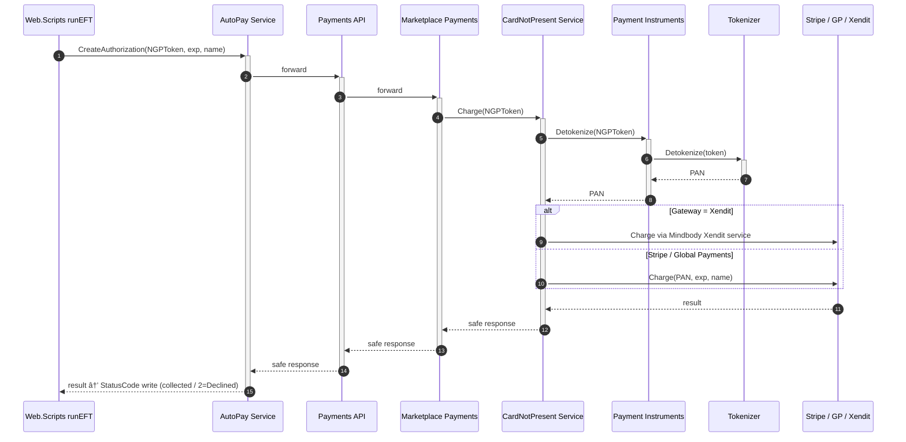

# AutoPay — High-Level Design (Existing System)

> Canonical source: [AutoPay — High-Level Design (Existing System)](https://app.notion.com/p/playlist/AutoPay-High-Level-Design-Existing-System-3c2dda30e231815789b0f09e1b17ca99) on Notion — synced 2026-08-31.
> Companions: LLD scenarios in `payments/autopay-lld-scenarios.md` · rewrite design in `payments/autopay-rewrite-hld.md` · repo catalog in `payments/repos.md`.

> **Scope.** High-level design of the *existing* AutoPay system — architecture, runtime data flows, data stores, retry semantics, idempotency, and grounded gaps. Claims are anchored to code (`file:line`), New Relic (acct 84467), or Snowflake. Provenance: **[G]** grounded first-hand · **[I]** inherited (Snowflake/Slack) · **[U]** unverified seam.
>
> **Code anchors re-verified 2026-08-20** against repos on disk: `Mindbody.Payments.AutoPay` main@831e541 · `Mindbody.Web.Scripts` main@e93e2f21 · `Mindbody.Payments.CardNotPresent` main@0c858fe · `Mindbody.Payments.Bank` main@92c445a.
> **Money path re-grounded 2026-08-20 PM** across newly cloned repos: `Mindbody.Api.Payments` main@b20f7db · `Mindbody.Services.Marketplace` master@8181b6e8b · `Mindbody.Map.PaymentProcessingV2` main@567e07d6 · `Mindbody.Payments.Instruments` main@d5abd0e · `Mindbody.Pricing` main@a6c6f7a · `Mindbody.Sales` main@9ce4acca · `Mindbody.Payments.Sessions` main@4163438. Corrections: no separate "NGP Payments API" (B1-direct and B2 hit the same `PaymentTransactionProcessingController` routes); Payments API → Marketplace is WCF net.tcp; `Map.PaymentProcessing` is a NuGet library inside Marketplace, not a service; Stripe/GP/Xendit selection happens inside CNP; MIT trigger is the `TransactionType` enum (no OffSession field on Payments API); fee chain = ASP → AutoPay API `autopay-fees/calculate` → Pricing `v2/payment-method/fees`. Still **[I]** (not cloned): Card Updater/CardSynchronizer, Web.Clients, Tokenizer, `GlobalNgpTokenLookup` SQL.

## 1 · What AutoPay is

AutoPay is the recurring-billing engine that charges members' stored payment instruments for membership/contract installments. An autopay **is a row in `tblEFTSchedule`** (per-studio subscriber SQL DB) — one row per future installment, written when a contract is sold. A scheduler-driven pipeline picks up due rows nightly (studio-local) and charges them. The system is **mid-modernization**: one modern orchestration front end, a per-studio **run wrapper** choice (whole ASP script vs C# wrapper that still executes charges via legacy `runEFT`), a per-charge fork to the modern NGP charge call (ChargeCCP-migration flag), plus an async contract side-channel — all live simultaneously. Sale composition never leaves ASP.

## 1a · Features (studio & member view)

What AutoPay delivers as product capability — not the internal pipelines.

### Studio (business)

- **Recurring membership billing** — Charge installments automatically on the schedule baked into the contract (weekly / monthly / yearly).
- **Stored payment methods on file** — Charge cards, ACH/bank, and wallets (e.g. Apple Pay) without the member present.
- **Contract-driven schedules** — Selling or changing a membership builds/updates upcoming autopay dates and amounts.
- **Studio-local charge night** — Runs on the studio’s local calendar day (not a single global midnight).
- **Automatic renewals** — After a successful cycle, the next cycle’s installments are scheduled so billing continues.
- **Decline retry window** — Failed charges can be retried over a configurable number of days before give-up.
- **Decline → account balance (optional)** — Uncollected declines can roll to the member’s account balance (studio setting).
- **Membership decline flagging** — Persistent payment failure can mark the membership as declined so staff can act.
- **Payment-method flexibility** — Same engine supports card, bank/ACH, and wallet methods per member.
- **Card updater / keep-cards-fresh** — Expired or reissued cards can be updated on file so future autopays keep working.
- **Staff visibility of schedule status** — See scheduled / submitted / success / declined (and reason text) per installment.
- **Operational pause (suspension)** — Runs can be suspended when needed (ops kill-switch; experienced as a billing pause).
- **Multi-gateway coverage** — Works across processors studios already use (Stripe, Global Payments, Xendit, etc.) without changing the billing ritual.

### Member (end customer)

- **Set-and-forget dues** — Membership renews/charges without checking out each period.
- **Choose preferred payment method** — Card, bank, or wallet where the studio supports it.
- **Update payment method** — Swap card/bank so the next autopay uses the new instrument.
- **Predictable charge dates** — Charges follow the contract schedule the studio sold them.
- **Failure feedback (via studio)** — Declines surface as failed installment / membership status so they can fix payment details.
- **Consumer wallet continuity** — Where consumer apps share billing info, the same stored method can feed recurring charges.

### Not productized today (useful contrast)

- True **dunning** (notify → staged retry → escalate → cancel)
- **Smart decline handling** (soft vs hard declines treated differently)
- Strong **self-serve recovery UX** comparable to modern subscription platforms

## 2 · Architecture at a glance

```mermaid
flowchart TD
  subgraph A["Pipeline A · Orchestration — Mindbody.Payments.AutoPay, C# on AWS"]
    EB["EventBridge rules ×4"] --> CSR["Lambda CreateScheduleRuns"]
    CSR --> MDB[("Mongo AutoPay<br/>ScheduleRuns · StudioRuns")]
    MDB --> PSR["Lambda ProcessScheduleRuns"]
    PSR -->|"suspension gate"| SNS1["SNS schedulerun"]
    SNS1 --> G1{"Gate 1 · LaunchDarkly<br/>partition modernized?"}
    G1 -->|"NO → V1"| PROXY["ScriptsProxy → legacy nightly"]
    G1 -->|"YES → V2"| FAN["Per-studio fan-out → SNS studiorun"]
    FAN --> EXE["StudioRun execution<br/>idempotent · ≤5 attempts"]
  end
  subgraph WRAP2["Per-studio run wrapper · Gate 2"]
    G2{"Gate 2 · studio in<br/>ScriptsAutopayV2Entities?"}
    G2 -->|"NO → V1 route"| B1["B1 · Whole ASP script<br/>adm_daily_autopay.asp"]
    G2 -->|"YES → V2 route"| WRAP["Script/Autopay C# wrapper<br/>C# selection + per-client loop"]
    WRAP -->|"POST per client"| V2ASP["adm_daily_autopay_v2.asp"]
  end
  subgraph CHARGE["Shared charge engine · Gate 3"]
    RUNEFT["runEFT (inc_run_eft.asp)<br/>sale composition · status writes · renewal"]
    RUNEFT --> G3{"Gate 3 · MBPS + ChargeCCP-migration<br/>LD partition?"}
    G3 -->|"NO · direct"| PAPI["Payments API · Subscriber/id/TransactionProcessing<br/>Authorize/CreditCard · Bank · PaymentMethodId"]
    G3 -->|"YES · via B2"| NGPA["B2 · PaymentAutopayService (AutoPay API)<br/>v2/CreditCard · v2/bank"]
    NGPA -->|"same routes"| PAPI
    PAPI -->|"WCF net.tcp"| MP["Marketplace Payments<br/>Map.PaymentProcessing NuGet · MbpsGateway"]
    MP -->|"HTTP"| PROC["CNP /charges · /authorizations — cards<br/>Bank /charges ACH · /paymentintent wallet<br/>Stripe · GP · Xendit picked inside CNP"]
  end
  PROXY --> B1
  EXE --> G2
  B1 --> RUNEFT
  V2ASP --> RUNEFT
  RUNEFT -->|"status writes"| EFTS[("tblEFTSchedule<br/>schedule of record")]
  SQSC["SQS contract events — non-FIFO"] --> PC["Pipeline C · ContractAutoPayEventService"]
  PC -->|"relative DATEADD UPDATE · no dedup ❌"| EFTS
```

**Key structural fact (corrected 2026-08-20 after code trace):** there are **three independent gates**, not two. Gate 1 (LD partition) picks orchestration; Gate 2 (`ScriptsAutopayV2Entities`) picks the **per-studio run wrapper** — whole ASP script vs `Script/Autopay` C# workflow, but the V2 wrapper still executes **every charge inside legacy `runEFT`** via per-client `adm_daily_autopay_v2.asp`; Gate 3 (ChargeCCP-migration LD flag + MBPS) decides — **from inside** `chargeCCP` (`inc_ccp.asp:1891/2051/2125`) — whether the charge call goes to the modern PaymentAutopayService (B2 → NGP) or the legacy Payments-API path. Sale composition, status writes, and renewal never leave ASP in any lane.

| Component | Role | Tech | Anchor [G] |
|---|---|---|---|
| EventBridge rules ×4: Create 15m · Process 5m · ProcessStudio 1m · Complete 5m (prod adds a 2nd studio-run rule) | Drive the run lifecycle | AWS EventBridge | `infrastructure.yaml:211-241` (staging) · `:970-1007` (prod) |
| CreateScheduleRuns / ProcessScheduleRuns / ProcessStudioRuns / CompleteScheduleRuns | Create runs → gate → fan out → close out | Lambda (C#) | `Function.cs:35,44,53,62` |
| Run ledger | Mongo `AutoPay` DB: Schedules · Suspensions · ScheduleRuns · StudioRuns | MongoDB | `MongoDbConstants.cs:16-36` |
| Suspension gate | Operator kill-switch; proceed iff no active suspension | service check | `ScheduleRunService.cs:298-300` |
| Gate 1 flag | `modernize-autopay-enabled-partitions` | LaunchDarkly | `LaunchDarklyConstants.cs:8` · `ScheduleRunService.cs:366-368` |
| Gate 2 route | Per-studio **run wrapper** URI: V1 whole ASP script (:12) vs V2 `Script/Autopay` C# workflow (:13). V2 = C# selection (`AutopayRepository.Find`) + pre-process (`skipRunEFT=true`) + per-client POST to `adm_daily_autopay_v2.asp` → same `runEFT` | allow-list config (`ScriptsAutopayV2Entities`) | `ScriptsApiClient.cs:12-13,69-73` · `ScriptController.cs:169-204` · `AutopayScriptWorkflow.cs:89-236` · `adm_daily_autopay_v2.asp:88` |
| Gate 3 charge-call fork | Inside `runEFT`/`chargeCCP`, per charge: modern PaymentAutopayService iff processor=MBPS **and** partition in ChargeCCP-migration LD flag; else legacy path. Applies in **both** V1 and V2 wrappers | LD partitions flag (`GetPartitionsForChargeCCPMigration`) | `inc_ccp.asp:1891,2051,2125` · `inc_autopay_service.asp:23-34` |
| Legacy charge (B1) | Select due rows, authorize (+capture), write status | Classic ASP | `adm_daily_autopay.asp:468,531,719-726` · `inc_run_eft.asp` · `inc_ccp.asp:1821-1832` |
| Modern charge (B2) | Validated, idempotency-aware **charge call invoked from inside ASP `runEFT` via Gate 3** (lives in AutoPay repo, `Api/Controllers/AspMigration`) | C# → NGP | `CreditCardController.cs:78-86` · `CreditCardService.cs:82,231-267` · `PaymentApiClient.cs:96-97` |
| Contract side-channel (C) | Contract changes mutate schedule dates async | SQS → Lambda | `infrastructure.yaml:949-955` (non-FIFO queue) · `ContractAutoPayEventService.cs:41-87` · relative `DATEADD` in `SqlQueries.cs:86-127` |

## 2a · End-to-end data-flow scenarios

Full sequences (S1–S13) live on the child page: [AutoPay — End-to-end data-flow scenarios](https://app.notion.com/p/3c2dda30e2318117b6f7ee8181f11abd) (local: `autopay-hld-scenarios.md`).
## 3 · Nightly runtime flow (Pipeline A → charge)

1. **Schedule creation (weeks earlier).** Contract sale / staff admin writes one `tblEFTSchedule` row per installment: `ClientID`, `ClientContractID`, `ScheduleDate` (studio-local), `Method`, `StatusCode=1`.
2. **Run creation.** EventBridge fires → `CreateScheduleRuns` writes ScheduleRun docs to Mongo.
3. **Run processing.** `ProcessScheduleRuns` re-reads due runs, **suspension gate** (proceed iff `FetchActiveSuspensionAsync == null`), publishes one event per run to SNS `payments-autopay-schedulerun`.
4. **Gate 1.** Partition in LaunchDarkly flag? NO → V1 `ScriptsProxy` hands the whole run to the legacy nightly (`ScheduleRunService.cs:443-446` → `ScriptExecutor.cs:24-40`). YES → V2 creates one StudioRun per active studio (`ScheduleRunV2Service.cs:160-167,242-265`) → SNS `studiorun`.
5. **StudioRun execution.** Not-yet-executed check + attempt cap (≤5), `IdempotencyKey = ScheduleRunId` (`StudioRunService.cs:569,589,638` · `Constants.cs:22-23`).
6. **Gate 2.** `ScriptsApiClient.GetRequestUri` routes the studio run to V1 (whole ASP script) or V2 (`Script/Autopay` C# workflow → C# selection → per-client `adm_daily_autopay_v2.asp`). Either way, each charge executes inside legacy `runEFT`.
7. **Gate 3 + charge.** Inside `runEFT`/`chargeCCP`: MBPS studios in the ChargeCCP-migration LD partitions call B2 (`PaymentAutopayService` → NGP, `inc_ccp.asp:1891`); all others use the legacy Payments-API path. `runEFT` itself writes status back to `tblEFTSchedule` — no cross-service write-back seam.
8. **Renewal.** On contract-cycle success, legacy code **blind-INSERTs** the next cycle's rows (`inc_run_eft.asp:2655,2701` — no lock / no NOT-EXISTS guard).

## 4 · Charge egress — the money path

Canonical modern-era flow (**Charge by NGPToken — enabled 100% for MBPS**): the PAN is only ever materialized inside CNP, at the last hop before the gateway.

- **Legacy variant (Charge by PAN):** Scripts itself detokenizes via Payment Instruments → Tokenizer and passes the PAN down the same chain — wider PCI scope; being displaced by the NGPToken flow (`inc_ccp.asp:569-572` branches on `hasNgpToken`).
- **Legacy B1 charge call (verified on current main):** `inc_ccp.asp` posts to `{PaymentsApiUrl}/Subscriber/{StudioID}/TransactionProcessing/Authorize` with a `Capture` flag set for MBPS real-time (auth+capture in one call) — `inc_ccp.asp:1821-1832`. An older XML `ccAuthorize` path remains for legacy processors (`:1695-1739`).
- **Gateways:** Stripe (majority) · Global Payments (migrating to Stripe) · Xendit (2026, TH/ID) · legacy EziDebit / Paysafe / Bluefin (all migrating).

## 5 · Payment-method fork

The schedule's `Method` picks the endpoint, processor, and — critically — whether the merchant-initiated (MIT) tagging chain is applied.

| Method | Endpoint | Processor [G] | MIT chain |
|---|---|---|---|
| 1 · plain card | `Authorize/CreditCard` | CNP `StripeCardProcessor.cs:834-846` | ✅ `OffSession=true` + NetworkTransactionId **or** MIT exemption |
| 3 · ACH | `Authorize/Bank` | `StripeAchBankProcessor.cs:112-133` | ✅ OffSession + inline mandate |
| 801 · Apple Pay / PaymentMethodID | `Authorize/PaymentMethodId` | Bank `StripeProcessor.cs:779-782` | ❌ `setup_future_usage` only — no OffSession, no MIT chain |

> âš  Apple Pay recurring **rides the Bank lane** (Method 801 → `MbpsGateway.cs:99-121` **[G]** verified: POST Bank `/paymentintent`, Bank `PaymentsController.cs:38-43`), a different processor than plain cards. Root cause of the wallet success-rate gap (~59% vs ~79% card) is **routing by method type**, not broken wallet code: the Bank processor's recurring branch sets `PaymentMethod + Confirm` only (`StripeProcessor.cs:756-761`) and `SetupFutureUsage` (`:779-782`) — never charge-time `OffSession`/MIT (the only Bank-side `OffSession=true` is ACH, `StripeAchBankProcessor.cs:112`). `transaction_not_allowed` runs ~2.5× the card rate on wallets. **[G]**

## 6 · Data stores

| Store | Tech | Holds | Role |
|---|---|---|---|
| `tblEFTSchedule` | Subscriber SQL (per studio) | Installment rows: ClientID, ContractID, ScheduleDate, Method, StatusCode, reason text | **Schedule of record** |
| ScheduleRuns · StudioRuns | Mongo (AutoPay svc) | Run ledger, attempts, idempotency keys | Orchestration state |
| `tblCCNumbers` | Subscriber SQL | NGP token + card metadata (also ACH/APM) | Business-mode stored cards |
| `UserBillingInfo` | MB Users SQL | NGP token + metadata | Consumer wallet |
| `CreditCards` | MB Payments SQL | NGP token + metadata | Aggregated cache (apps/checkout/Public API subset) |
| `NgpTokenDocument` (`NgpTokens` collection) | Instruments Mongo | `Id` = NGP token id · `Token` = security-tokenizer token · `Fingerprint` = SHA512 dedup hash (`NgpTokenDocument.cs:10-40` · `MongoDbConstants.cs:36`); detokenize `GET v1/ngpTokens/{id}` (`NgpTokenController.cs:32-48` → `NgpTokenService.cs:160-180`) | Token indirection **[G]** |
| `TokenDataObjects` | Tokenization DynamoDB | Security token ↔ PAN | Vault |
| `tblCCTrans` | Subscriber SQL | NGP token alongside txn, ~30 days | Incident support |
| `GlobalNgpTokenLookup` | SQL (aggregated) | All `tblCCNumbers` tokens, refreshed monthly | Orphan-token sweep bridge |

**Writers of `tblEFTSchedule`** (why it's the contention point):

| Writer | Operation | Protected? |
|---|---|---|
| Contract sale / staff admin | INSERT installment rows | — |
| B1 runEFT | Status transitions (1/2→5→outcome) | ⚠ flag, not a lock (`SET StatusCode=5, StatusMessage='Submitted'`, `inc_run_eft.asp:1014-1059`) |
| B1 renewal | INSERT next cycle | ❌ blind INSERT (`inc_run_eft.asp:2655,2701`) |
| Pipeline C contract events | Relative `DATEADD` UPDATE of next charge date | ❌ no key/dedup on non-FIFO SQS → double-advance |
| Card Updater apply-back | UPDATE card-on-file the charge reads | ✅ live, ~130K cards/mo (`CardSynchronizer.ApplyCardUpdatesToStudio:203` **[I]** — repo not cloned) |

## 7 · Retry, decline & give-up semantics

**Two retry layers, one missing layer:**

| Layer | Owner | Mechanics [G] |
|---|---|---|
| Run-level (operational) | Modern AutoPay svc | ≤5 attempts per StudioRun; new attempt iff not done, under cap, not expired — reads timestamps/counts only, **never a decline code** (`Constants.cs:22-23` · `StudioRunService.cs:640,647`); manual rerun endpoint with `ForceRetry` flag (`ScheduleRunController.cs:213`) |
| Decline-level (per schedule) | Legacy ASP | Nightly re-pick of `StatusCode IN (1,2)` within the look-back window (`adm_daily_autopay.asp:468`); window = `max(AutoPayRetryDays, DaysToLookBackForScheduledAutopays)` for scheduled rows, `AutoPayRetryDays` alone for declined rows (`:719-726`). Decline writes `StatusCode=2` + reason **as display text only** (`UpdateStatusToDenied`, `inc_run_eft.asp:329-349` — `APLastStatus="2"` :334) |
| Dunning (notify → re-attempt → escalate) | **does not exist** for MBPS autopay | `dunning` token = 0 matches in modern svc; give-up is **time-based**: age out of window, optionally convert the declined charge to account balance (`inc_run_eft.asp:2451-2457`, gated by `ss_FeeDeclinedCCToAccount`) · membership flagged declined (`UpdateMembershipToDeclined` call `:1941`) |

**StatusCode lifecycle:** `1 Scheduled → 5 Submitted (in-flight guard) → 3 Success` (or `4 Charged-with-errors` `:1920-1922` · `6 ACH FTP batch` `:2469-2470`) `· 2 Declined → re-picked nightly until success or window edge → account-balance conversion`.

> 🔁 **The retry loop is decline-blind.** The decline reason never branches behavior — `stolen_card` retries on the same cadence as `insufficient_funds`. CNP maps Stripe decline codes (`MapStripeDeclineCode`, `StripeCardProcessor.cs:902`) but the result feeds analytics only (`:229`). Measured effect: 13,660 hard-terminal schedules re-hit ~3.9× each = **52,685 doomed auths/mo**; ~341K/mo hit cards already flagged `previously_declined_do_not_retry`. Foot-gun: `AutoPayRetryDays=0/1` collapses the **declined-row** re-pick window (~1 attempt per decline) — 2,305 studios on $133.7M scheduled GMV sit there. (Scheduled rows now have a `DaysToLookBackForScheduledAutopays` config floor, `adm_daily_autopay.asp:719-721`; the declined window still keys off `AutoPayRetryDays` alone, `:726`.) **[G]**

## 8 · Idempotency map

| Hop | Status | Why [G/I] |
|---|---|---|
| StudioRun execution (modern) | ✅ holds | Not-yet-executed check + attempt cap; `IdempotencyKey = ScheduleRunId` (`StudioRunService.cs:569-573,589,638`) |
| NGP charge (modern) | ✅ holds | Resolves idempotency errors instead of blind re-charge (`PaymentApiClient.cs:96-97` · `CreditCardService.cs:231-267`) |
| Contract-change UPDATE (Pipeline C) | ❌ none | No key/dedup; relative write on at-least-once SQS → **silent double-advance** (legacy ADO #1447610 reintroduced) |
| Legacy re-run guard (B1) | ⚠ best-effort | Status flag 1/2→5 'Submitted', not a lock (`inc_run_eft.asp:1014-1059`) |
| Legacy contract renewal (B1) | ❌ none | Blind INSERT of next cycle (`inc_run_eft.asp:2655,2701`) |

## 9 · Grounded gaps (existing-design risks)

- **No decline-class routing anywhere** — soft vs terminal never gates a retry (foundation gap). **[G]**
- **Pipeline C double-advance** — the modernization met idempotency on the charge path but not the schedule-mutation path. **[G]**
- **Wallet MIT gap** — Method-801 lane omits OffSession/MIT tags the card lane sets. **[G]**
- **No dunning state machine** — no notify/freeze/cancel; give-up is time-only. **[G]**
- **`AutoPayRetryDays=0/1` silent-disable** of declined-row retry (2,305 studios; scheduled rows are floored by config since then). **[G]**
- **Observability split** — two log formats; ~46% of decline lines drop the schedule id; `failure_code` never emitted at the decline write. **[G]**
- **[U] seam — RESOLVED (2026-08-20, first-hand trace):** `Script/Autopay` is a C# wrapper (`ScriptController.Autopay` → `AutopayScriptWorkflow`) that executes every charge via per-client `adm_daily_autopay_v2.asp` → `runEFT`; the modern B2 charge call fires from **inside** ASP (`inc_ccp.asp:1891/2051/2125`) behind the ChargeCCP-migration LD flag. No cross-back seam exists — `runEFT` writes statuses natively. **[G]**

## 10 · Scale (measured, May–Jun 2026)

| Metric | Value | Source |
|---|---|---|
| First-attempt success rate | ~79.5% (card ~79% · wallet ~59% · ACH 94–96%) | Snowflake mart, NR cross-check |
| First-attempt failures (Scripts surface) | 869,047 / mo | Snowflake, May 2026 |
| Failed charge attempts | ~1.3M / mo across ~252K schedules (mean 5.2 · median 3 · p99 31) | NR MB-Prod, 1 mo |
| Terminal (never collected) | 137,802 / mo ≈ $15.6M (× $112.98 avg ticket) | Snowflake, clean May baseline |
| Unrecovered declined-card pool | ~$8.5M / mo (STATUS_CODE=2, June-25 raw EFT mart) | Snowflake |
| Dunning coverage today | ~69K of 869K failures (~8%) chased | Snowflake |
| Card Updater apply-back | ~130K cards applied / mo, 20,145 studios | NR, 7d sized |

## 11 · Repo map

| Segment | Repo |
|---|---|
| Run orchestration (A, C, B2 client) | `Mindbody.Payments.AutoPay` |
| Legacy charge script (B1) | `Mindbody.Web.Scripts` (adm_daily_autopay.asp · inc_run_eft.asp · inc_ccp.asp) |
| Autopay admin / domain helpers | `Mindbody.Web.Clients` |
| Charge API — same service for B1-direct and B2 (`PaymentTransactionProcessingController`) | `Mindbody.Api.Payments` **[G]** main@b20f7db |
| Autopay fee calculation (ASP → AutoPay API → Pricing) | `Mindbody.Pricing` **[G]** main@a6c6f7a (`FeeController.cs:15-56`) |
| Token indirection + detokenize + orphan sweep | `Mindbody.Payments.Instruments` **[G]** main@d5abd0e |
| Observe-only autopay sale-integrity validation | `Mindbody.Sales` **[G]** main@9ce4acca |
| Gateway dispatch | `Map.PaymentProcessingV2` · `Services.Marketplace` |
| Processors | `CardNotPresent` · `Bank` · `CardPresent` · Xendit · GP |
| MBPS stored procs / `tblEFTSchedule` writes | — DB only, not a repo — |

## 12 · Sources

- Notion: [Small Change Giant Leap : AutoPay](https://app.notion.com/p/38adda30e23180189041fa1884498aad) · [PCI Dataflows 2026 — Scripts](https://app.notion.com/p/2d070909ec95410c9d1ea629dce112e6) · [PCI 2026 hub](https://app.notion.com/p/211dbd6ef535425288aaee81137412ed) · [PCI — Consumer Applications](https://app.notion.com/p/ef473aca77fe48c19a619da90234f224)
- Local grounded ledgers: `the-pitch.html` · `autopay-end-to-end-flow.html` · `autopay-recovery-classification.html` (built 2026-07-01→03)
- Repos on disk: `Mindbody.Payments.AutoPay` · `Mindbody.Web.Scripts` · `Mindbody.Payments.CardNotPresent` · `Mindbody.Payments.CardPresent` · `Mindbody.Payments.Bank` · `Mindbody.Api.Payments` · `Mindbody.Services.Marketplace` · `Mindbody.Map.PaymentProcessingV2` · `Mindbody.Payments.Instruments` · `Mindbody.Pricing` · `Mindbody.Sales` · `Mindbody.Payments.Sessions`

---

## 13 · Deep-pass addendum (2026-08-20 PM — exhaustive re-review, all flows)

CNP, Bank, and CardPresent internals traced end-to-end; seven previously-undocumented flows documented (scenarios S14–S20 on the child page). All facts below are code-grounded **[G]**.

### 13.1 CNP internals (main@0c858fe)
- `/charges` is a **single PSP call** (Stripe `CaptureMethod=automatic`, GP `CaptureMode=Auto`) — not auth-then-capture (`ChargesController.cs:153-160` · `StripeCardProcessor.cs:133-144`); two-step only via `/authorizations` + capture endpoint.
- Gateway selection: merchant account's `GatewayType` (Stripe/GlobalPayments/Xendit) → `CardProcessorFactory` (`GatewayType.cs:6-22` · `CardProcessorFactory.cs:19-40`).
- Decline classification: `MapStripeDeclineCode` (`StripeCardProcessor.cs:902-924`) and GP's `MapGlobalDeclineCode` (`GlobalPaymentsCardProcessor.cs:525-538`) write a Mongo `Declines` collection only; HTTP callers get coarse `ErrorCode` — the retry loop cannot branch on decline class even in principle. Xendit maps to ErrorCode only (no declines write). Only consumer of `DeclineReason`: Consumer-lane card-attack limits — autopay (Merchant/Recurring) skips it (`CardNotPresentService.cs:1084-1165`).
- `previously_declined_do_not_retry` does **not** exist in CNP/Map/AutoPay code — it is external Stripe decline data (would map to `Other`).
- CNP idempotency = Mongo lock (5-min TTL, unique tenancy+key) surfacing `ExistingChargeId`/`ChargeInProgress` (`CardNotPresentService.cs:1009-1075`); the Stripe **create** call carries no Stripe idempotency key — NGP key is metadata only (`StripeCardProcessor.cs:186-189,958`); GP create does pass one.
- Detokenize via Instruments **paymentTokens facade**: `POST v1/paymentTokens` (NGP token) / `GET v1/cards/{id}/detokenize` (`PaymentInstrumentServiceClient.cs:14-55`).
- MIT per gateway: Stripe extras (`OffSession`/`mit_exemption`/NTI) are Stripe-only; GP uses `stored_credential` (Recurring → Initiator=Merchant, Sequence=Subsequent) + `BrandReference`=NTI (`GlobalPaymentsCardProcessor.cs:343,380-420`); Xendit passes TransactionType/NTI through, no MIT extras, ignores `intent.Capture` (`XenditCardProcessor.cs:72-74`). Post-success NTI upsert per card token (`CardNotPresentService.cs:384-390`).

### 13.2 Bank internals (main@92c445a)
- `/charges` **always returns `Pending`** regardless of gateway state (`BankService.cs:149-155`); outcomes arrive via `payment_intent.*` webhooks (PI path only, `StripeEventTypes.cs:8-13`) or GET polling that re-reads the gateway and republishes SNS (`BankService.cs:185-204`). Legacy Charge-API ACH (`ch_…`) has **no webhook coverage** — polling only.
- Rail selection by **merchant currency**: USD→ACH, GBP→BACS, AUD→BECS, NZD→NzBECS, EUR→SEPA/iDEAL, CAD→ACSS (`MerchantConfiguration.cs:111-123`). GoCardless absent; GP ACH is the alternate USD gateway.
- **EU-rails MIT gap**: SEPA/BACS/BECS/NzBECS subsequent charges send Confirm+PM only — no charge-time `OffSession` (`StripeSepaBankProcessor.cs:425-443` pattern); ACH is the only Bank rail with charge-time `OffSession` (`StripeAchBankProcessor.cs:111-136`). `StripeIdealBankProcessor.ChargeAsync` throws NotImplementedException (iDEAL = paymentintent only).
- No FTP/NACHA code anywhere in Bank — `StatusCode=6` is purely legacy ASP (see 13.3).
- Wallet lane re-confirmed: `IsRecurringPayment` is alive (customer/PM selection, validation, Confirm) but zero `OffSession` matches in `StripeProcessor.cs`.
- CardPresent: terminal sale + refund service; refund route consistent with MbpsGateway CP refund dispatch; **not** on any recurring charge path; its `IsAutopay` is hardcoded false (`StripeSetupIntentService.cs:86`).

### 13.3 Previously-undocumented flows (details in scenarios S14–S20)
- **S14 Failed-payment notification**: member auto-email type 38 after decline; `AutoPayFailedEmailSent` stamped but the ISNULL dedup guard is commented out in V1 and V2 (`adm_daily_autopay.asp:880-882` · `adm_daily_autopay_v2.asp:156-159` · `inc_emailer.asp:4832-4847,4387-4389`) — can re-email nightly.
- **S15 Unsuspension**: nightly pre-phase flips suspended rows `StatusCode -1 → 1` with dates pushed; deletes leftover suspension fees ProductID -8 (`adm_daily_autopay.asp:686-708` · `inc_contract_suspend.asp:457+`).
- **S16 Count-series wake ("AAR")**: UPDATE-only — sets `ScheduleDate=today` on the MIN dormant row per (client, product); never INSERTs, never touches `tblEFTHidden` (`adm_daily_autopay.asp:459-470`).
- **S17 Rerun/manual**: rerun endpoint (24h, Failed-only, `ScheduleRerunId` chain, failed-studios-only re-creation, **no ForceRetry**; `ScheduleRunService.cs:472-534` · `ScheduleRunV2Service.cs:300-320`); ForceRetry lives on manual create; manual StudioRun pre-starts its parent run (`StudioRunService.cs:250-326`).
- **S18 Close-out**: `CompleteScheduleRuns` 5-min job; 24h look-back only (older unfinished runs linger open forever); mixed outcomes → Failed; failed runs never update `tblNightlyScriptLog` (`ScheduleRunService.cs:561-629` · `ScheduleRunProvider.cs:222-260` · `StudioRunProvider.cs:334-405`).
- **S19 Legacy batch ACH**: `StatusCode=6` only for Method=3 on MON/OP (`inc_run_eft.asp:2468-2470`); settled by `adm_daily_ach.asp` RBC FTP pull into `tblCCTrans` + `returnToAccount` on reject; EFT row stays 6 forever.
- **S20 Account autopay (Method=2)**: no gateway; payment method 16; negative PD ProductID 99 + account debit (`inc_run_eft.asp:1890-1899,3093-3162`); split above `cltAutoPayLimit` (`:1567-1570`); decline-to-account via `ss_DeclinedCCToAccount` + `returnToAccountWithoutInvoiceRepopulate` (`:1577,2452-2456`); no rewards on account sales (`:3172-3173`).

### 13.4 New grounded gaps (added to §9 on Notion)
1. **Pipeline C poison loss** — no SQS DLQ; message deleted after 3 in-lambda retries (`SqsLambdaBase.cs:148-153`).
2. **Failed-email dedup dead code** (S14).
3. **Run close-out blind spots** — 24h scan window, no run wall-clock timeout, mixed → Failed, failed runs skip legacy log (S18).
4. **EU-rails MIT gap** (13.2).
5. **Legacy-ACH webhook blindness** — PI-only webhooks; Charge-API outcomes by polling; returns land in `tblCCTrans` while EFT stays 3.

### 13.5 Other corrections applied to this doc's sections
- §3: run creation detail (Schedules cadence, NodaTime, 1h-early/12h-late window, dedup) and new step 9 close-out.
- §6: `tblCCTrans` write ownership — placeholder INSERT at `chargeCCP` start (`inc_ccp.asp:510-512`); success/failure UPDATEs skipped when `usePaymentsApi` (`:2393`).
- §7: rerun-endpoint correction (no ForceRetry); give-up gating split (`ss_DeclinedCCToAccount` eligibility vs `ss_FeeDeclinedCCToAccount` fee flavor); decline-blindness now provably structural (CNP Mongo-only decline data).
- Sale composition order (runEFT): Sales header **before** charge → charge → `tblPayments` → per-line `[PAYMENT DATA]` + `[Sales Details]` → EFT status → renewal → fees → invoice queue + receipt type 14 (service sales) → rewards (`AddSalePoints`); class stats only via unpaids reconciliation (`inc_auto_rec_unpaids.asp:292-294`).
- XML `ccAuthorize` path = **Optimal Payments SOAP** (OP, and TEL+card), not GP (`inc_ccp.asp:1667,1683-1739`).
- EziDebit timeout kill-switch: V1 `response.end`s the studio run; V2 logs and continues (`adm_daily_autopay.asp:850-861` · `adm_daily_autopay_v2.asp:126-137`).
