# AutoPay — End-to-end data-flow scenarios

> This is the AutoPay LLD: code-verified end-to-end data-flow scenarios (S1–S20). Synced 2026-08-31.

Notion child of the HLD: https://app.notion.com/p/3c2dda30e2318117b6f7ee8181f11abd

> Flows re-verified against code 2026-08-20 — `Mindbody.Payments.AutoPay` main@831e541 · `Mindbody.Web.Scripts` main@e93e2f21 · CNP main@0c858fe · Bank main@92c445a. Money path re-grounded same day across newly cloned `Api.Payments` b20f7db · `Services.Marketplace` 8181b6e8b · `Map.PaymentProcessingV2` 567e07d6 · `Instruments` d5abd0e · `Pricing` a6c6f7a · `Sales` 9ce4acca: B1-direct and B2 hit the same Payments API `TransactionProcessing/Authorize/*` routes; Payments API → Marketplace is WCF; `Map.PaymentProcessing` is a NuGet library inside Marketplace; Stripe/GP/Xendit selection happens inside CNP. **Exhaustive deep pass (2026-08-20 PM):** CNP, Bank, and CardPresent internals traced; seven previously-undocumented flows added as S14–S20. Key anchors: Gate 1 consumer `ScheduleRunService.cs:349-376`, suspension `:298-300` + `StudioRunService.cs:167-171`, V2 fan-out `ScheduleRunV2Service.cs:156-203`, StudioRun pump `StudioRunService.cs:158-178,425-437`, attempt guard `:589-652`, Submitted flag `inc_run_eft.asp:1014-1016`, decline write `:329-354`, renewal `:2655,2701`, re-pick windows `adm_daily_autopay.asp:719-726`.
## 2a · End-to-end data-flow scenarios

Each scenario is one complete path through the live system. Gates are independent — **three of them** (corrected 2026-08-20): Gate 1 picks **orchestration** (whole-run V1 vs per-studio V2); Gate 2 picks the **per-studio run wrapper** (whole ASP script vs `Script/Autopay` C# workflow — which still charges via per-client ASP `runEFT`); Gate 3 (ChargeCCP-migration LD flag + MBPS) picks the **charge call inside `runEFT`** (legacy Payments API vs modern PaymentAutopayService → NGP).

| ID | Studio / member sees | Path | Outcome on `tblEFTSchedule` |
|---|---|---|---|
| S1 | Dues collected on charge night | Gate 1 NO → B1 legacy nightly | `1 → 5 → 3` (+ renewal INSERT) |
| S2 | Same, V2-orchestrated studio still on ASP charge | Gate 1 YES, Gate 2 NO → StudioRun → B1 | `1 → 5 → 3` |
| S3 | Same, V2 wrapper + modern charge call | Gate 1 YES, Gate 2 YES → Script/Autopay → per-client runEFT → Gate 3 → NGP | `1 → 5 → 3` written by runEFT itself |
| S4 | Card on file charged (MIT tagged) | Method 1 → CNP Stripe OffSession/MIT | Success or decline write |
| S5 | Bank / ACH autopay | Method 3 → Bank ACH OffSession + mandate | Success, or `6` if FTP batch |
| S6 | Apple Pay / wallet autopay | Method 801 → Bank `/paymentintent` (no MIT) | Higher `transaction_not_allowed` |
| S7 | Failed then recovered later | Decline `2` → nightly re-pick (decline-blind) | `2 → 5 → 3` (or stay `2`) |
| S8 | Failed until studio gives up | Age out of retry window | Optional account-balance; membership declined |
| S9 | Staff changes contract dates | Pipeline C SQS → relative `DATEADD` | Next `ScheduleDate` moved |
| S10 | Wrong next charge date (silent) | Duplicate non-FIFO SQS, no dedup | Double-advance |
| S11 | Membership continues next cycle | Success → blind renewal INSERT | New rows `StatusCode=1` |
| S12 | No charges tonight | Active suspension gate | Rows unchanged |
| S13 | Card updated, next due still works | Card Updater apply-back to `tblCCNumbers` | Same row, new instrument |
| S14 | Member emailed on failed autopay | Decline → auto-email type 38 (dedup guard is dead code) | Row unchanged; `AutoPayFailedEmailSent` stamped |
| S15 | Suspension ends, billing resumes | Nightly unsuspension pre-phase → `unsuspendContract` | `-1 → 1`, dates pushed by duration |
| S16 | Dormant count-series starts billing | Pre-charge wake: UPDATE NULL `ScheduleDate` → today | Same row becomes due tonight |
| S17 | Staff rerun / manual run | Rerun re-creates failed studios only · manual runs pre-start parent | Failed rows re-attempted |
| S18 | (ops) Run closed out | CompleteScheduleRuns every 5m, 24h look-back | Mongo stamps; legacy log only if Completed |
| S19 | Bank batch settles days later | MON/OP ACH → `6` → `adm_daily_ach.asp` FTP pull | `6` terminal; `tblCCTrans` Funded/Declined |
| S20 | Dues charged to account balance | Method 2 → payment method 16, no gateway | `3` without any auth |

### S1 · Happy path — legacy whole-run (Gate 1 NO)

Studio is **not** in the modernized LaunchDarkly partition. One nightly script run covers all due rows. Gate 1 is evaluated by the SNS schedulerun consumer (`ExecuteScheduleRunEventAsync`, `ScheduleRunService.cs:349-358`): the run executes V1 only if the partition is *disabled* in the flag, after a not-yet-executed check (`DateTimeStartedUtc == null`, `:424-436`). After handing off, the service confirms the script actually started and throws if not (`ConfirmScriptExecutionAsync`, `:457-465`) — so an unstarted V1 run is retried via the event pipeline.

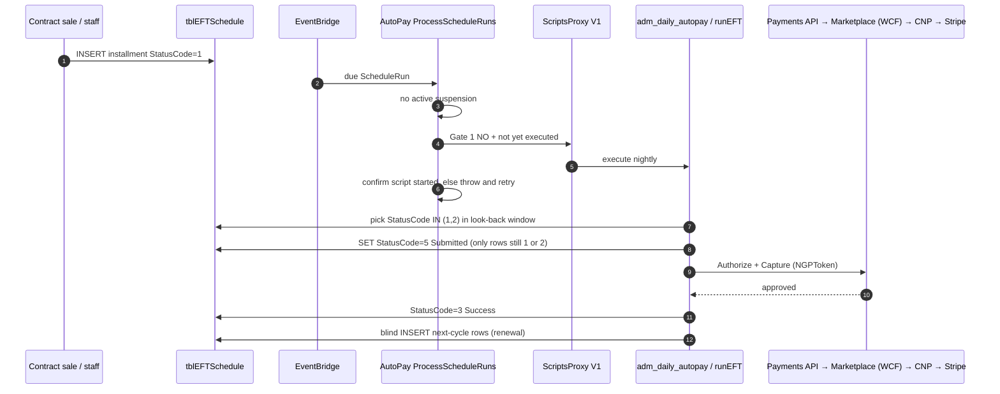

### S2 · Happy path — V2 orchestration + legacy charge (Gate 1 YES, Gate 2 NO)

Run is fanned out per studio, but this studio is **not** on `ScriptsAutopayV2Entities`, so charge is still Classic ASP. Two verified nuances: (a) V2 creation also writes legacy `tblNightlyScriptLog` + `tblNightlyScriptStatus` rows so legacy reporting stays in sync (`ScheduleRunV2Service.cs:183-189`); (b) StudioRun events are not published at creation — the 1-minute ProcessStudioRuns pump publishes them, throttled to `MaxParallelStudioRunLimit` minus currently-running (`StudioRunService.cs:158-178,425-437`).

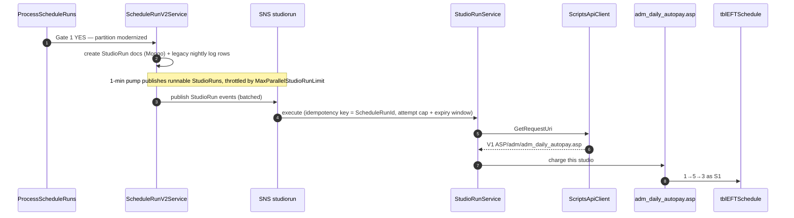

Attempt guard (`StudioRunService.cs:589-652`): skip if in-progress (recently modified, not completed/failed); refuse new attempt past `MaxAllowedRunAttempts` or past `DateTimeRunExpiresOnUtc`.

### S3 · Happy path — V2 wrapper + modern charge call (Gate 1 YES, Gate 2 YES)

**Corrected 2026-08-20 after first-hand trace — the old [U] seam is resolved.** `Script/Autopay` does **not** bypass ASP: the C# workflow (`ScriptController.Autopay` → `AutopayScriptWorkflow`) selects due autopays in C# (`AutopayRepository.Find`), pre-processes via `adm_daily_autopay.asp?skipRunEFT=true` (AAR creation + contract unsuspension, no charges), then POSTs **per client** to `adm_daily_autopay_v2.asp`, which runs the same legacy `runEFT`. The modern charge call (B2) fires from **inside** `chargeCCP` (`inc_ccp.asp:1891` cards, `:2051/:2125` bank) only for MBPS studios in the ChargeCCP-migration LD partitions. `runEFT` writes all statuses natively — no cross-back seam exists.

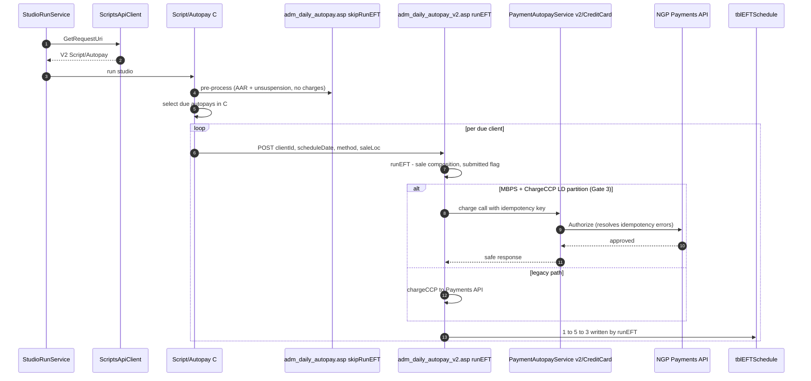

### S4 · Card (Method 1) — MIT tagged

Same money path as §4. The MIT trigger is `TransactionType` (ASP sends it at `inc_ccp.asp:1838`; no OffSession field exists on the Payments API): CNP maps non-Consumer → `OffSession=true` plus NetworkTransactionId **or** MIT exemption (`StripeCardProcessor.cs:831-847`).

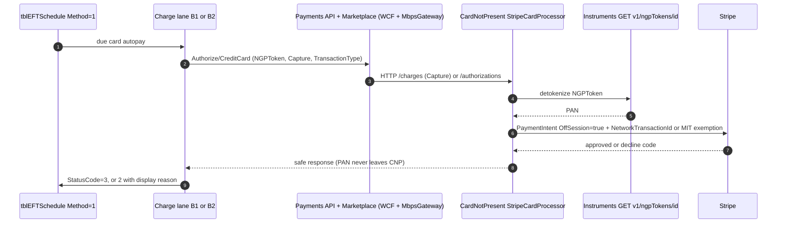

### S5 · ACH (Method 3)

Routes `Authorize/Bank/` → Bank `/charges`. The ACH processor sets charge-time OffSession + inline mandate (`StripeAchBankProcessor.cs:111-136`). **Ground truth 2026-08-20:** Bank **always answers `Pending`** regardless of gateway state (`BankService.cs:149-155`); the real outcome arrives days later via `payment_intent.*` webhooks (PI path only) or GET polling. Rail is picked by **merchant currency** — USD→ACH, GBP→BACS, AUD→BECS, NZD→NzBECS, EUR→SEPA (`MerchantConfiguration.cs:111-123`); non-ACH rails omit charge-time OffSession on subsequent charges (EU-rails gap). `StatusCode=6` is **not** this lane — it is the legacy MON/OP FTP batch (see S19). ACH returns after acceptance reconcile into `tblCCTrans`/account via `adm_daily_ach.asp` — the EFT row stays `3`.

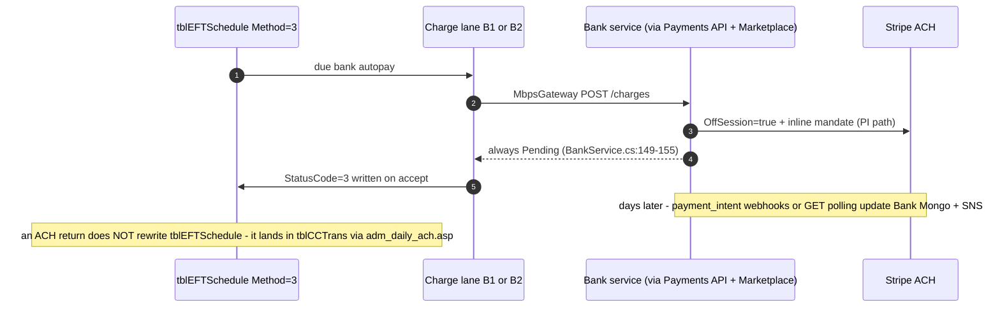

### S6 · Wallet / Apple Pay (Method 801) — no MIT

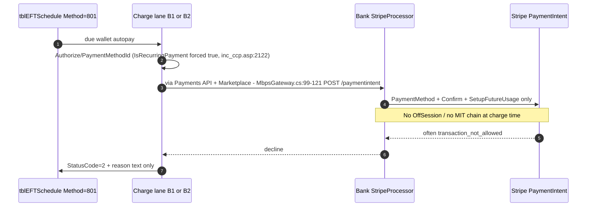

### S7 · Decline then recover (retry window)

Retry is **decline-blind**: `stolen_card` is retried on the same cadence as `insufficient_funds`. The decline write is not always `Declined - <reason>`: on a gateway-timeout ambiguity (response lost after possible capture) it writes `Audit` — flagged for human intervention (`UpdateStatusToDenied`, `inc_run_eft.asp:337-339`); TSYS timeouts write `Timed out` (`:340-343`). A `forceRetry` switch also allows same-day rerun of failed autopays during outages (`adm_daily_autopay.asp:729-731`).

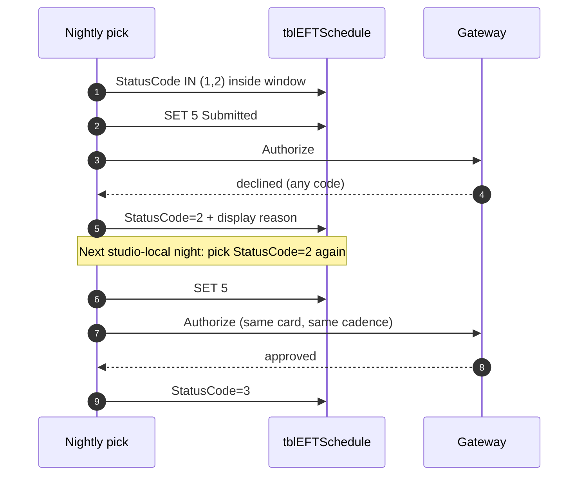

Declined-row window = `AutoPayRetryDays` only. Scheduled-row window = `max(AutoPayRetryDays, DaysToLookBackForScheduledAutopays)`. Ground truth 2026-08-20: CNP maps gateway decline codes into a Mongo `Declines` collection only — the HTTP caller receives a coarse `ErrorCode`, so the retry loop **cannot** branch on decline class even in principle (`StripeCardProcessor.cs:902-924,210-230`).

### S8 · Give-up (time-based, not dunning)

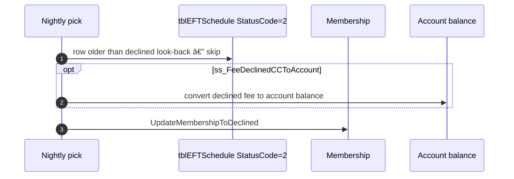

No notify / freeze / cancel state machine. `AutoPayRetryDays=0/1` collapses declined retries to ~1 attempt.

### S9 · Contract change moves next charge date (Pipeline C)

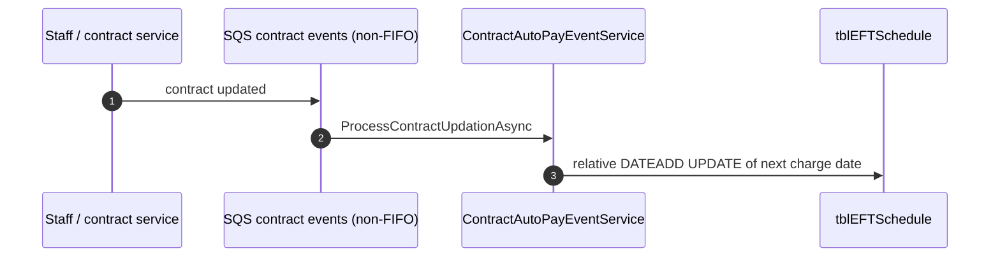

### S10 · Pipeline C double-advance (duplicate delivery)

Same handler as S9, **no idempotency key**. At-least-once SQS can apply `DATEADD` twice — next charge silently skips a cycle.

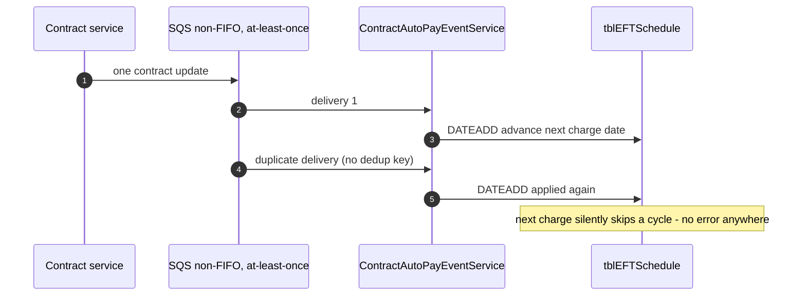

### S11 · Cycle renewal

On contract-cycle **success**, B1 **blind-INSERTs** the next cycle by copying template rows from `tblEFTHidden` (`INSERT INTO tblEFTSchedule … SELECT … FROM tblEFTHidden`, `inc_run_eft.asp:2655,2701`) — no lock / no NOT-EXISTS. Duplicate success or overlapping runs can duplicate future rows. When the autopay-transaction-fee flag is on, the INSERT captures new ids via `OUTPUT` and transfers autopay fees to them (`:2653-2685`).

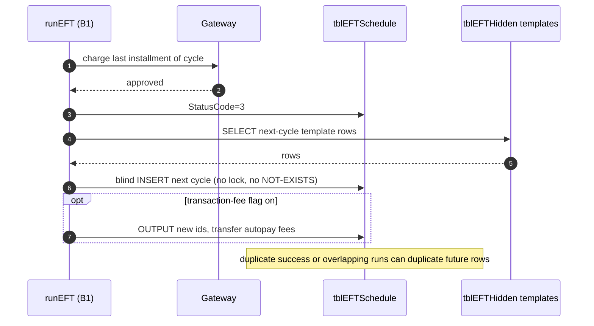

### S12 · Suspension (no charge night)

Suspension is enforced at three points: ScheduleRun event creation (`ScheduleRunService.cs:298-300`), the StudioRun pump (`StudioRunService.cs:167-171`), and manual studio runs, which are rejected outright with `OngoingSuspension` (`:262-265`). Active suspension: no SNS publish, no V1/V2 charge, schedule rows stay `1`/`2`.

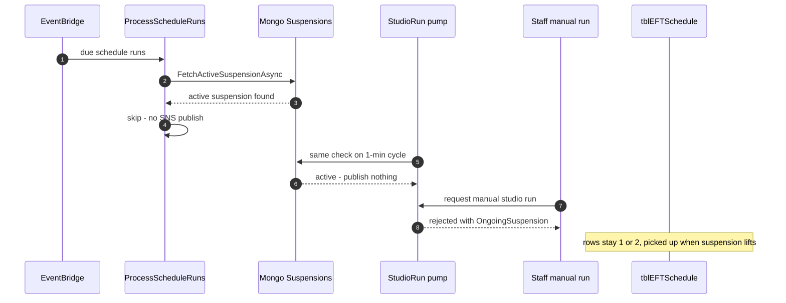

### S13 · Card updater (instrument changes, schedule does not)

Card Updater writes new PAN/token metadata onto `tblCCNumbers` (~130K cards/mo). Next S1–S3 read the updated instrument; `tblEFTSchedule` row identity is unchanged.

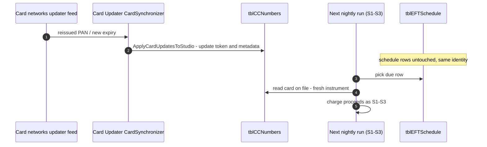

### S14 · Failed-payment notification (member email)

Triggered after `runEFT` on hard decline only: `NOT APSuccessful AND EmailOn(type 38) AND APLastStatus="2"` (V1 `adm_daily_autopay.asp:881-882` · V2 `adm_daily_autopay_v2.asp:158-159`). `sendAutopayFailedNotification` (`inc_emailer.asp:4832-4847`) selects tonight's declined rows for that client/date/method/location and sends member auto-email **type 38** per row; `AutoPayFailedEmailSent` is stamped after send (`:4387-4389`). **The dedup guard is dead code** — the ISNULL check is commented out in both lanes (`:880` / `:156`), so repeat declines can re-email every decline night.

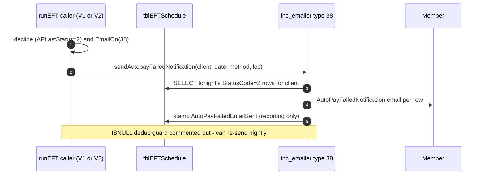

### S15 · Contract suspension ends (unsuspension night)

Runs inside the nightly **before** due-row selection (`adm_daily_autopay.asp:686-708`): picks `tblClientContractSuspend` rows past `SuspendEnd`, calls `unsuspendContract` (`inc_contract_suspend.asp:457`). Suspended autopays sit at `StatusCode=-1` (excluded from every pick); unsuspension soft-deletes leftover suspension-fee rows (ProductID `-8`), extends series and contract end date, and flips `-1 → 1` with `ScheduleDate` pushed by the suspension duration.

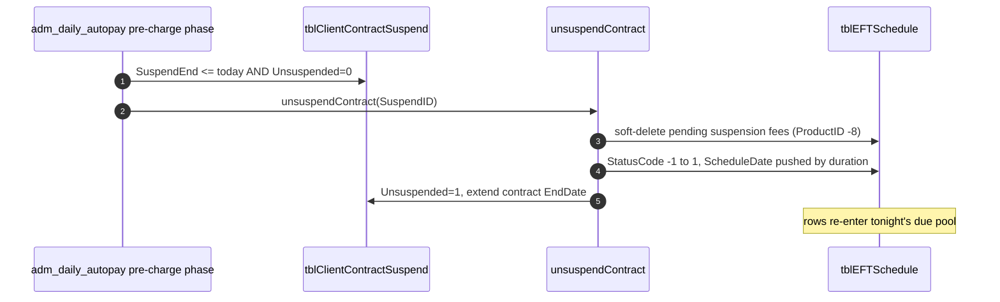

### S16 · Count-series wake ("auto-autorenew" — UPDATE, not INSERT)

Pre-charge phase `runAutoAutoRenews` (`adm_daily_autopay.asp:358, 459-470`): for each (client, product) holding a **dormant count-series row** (`ScheduleDate IS NULL`, `StatusCode=1`) with no active `[PAYMENT DATA]` and no other EFT within `AutoPayRetryDays`, set `ScheduleDate = today` on the `MIN(EFTScheduleID)` row — waking it into tonight's pick. Distinct from contract renewal (S11), which INSERTs new rows from `tblEFTHidden` after success; the wake never inserts and never touches `tblEFTHidden`.

### S17 · Staff rerun and manual runs

**(a) Unfinished rerun** — `POST v1/scheduleruns/{id}/rerun` (`ScheduleRunController.cs:199-217`): eligible only if the run **Failed**, within **24h**, and not already rerun (`ScheduleRunService.cs:472-516`). Creates a new run copying `ScriptRunId`/`ReferenceGroupId`, links via `ScheduleRerunId` (`ScheduleRunProvider.cs:269-329`); execution re-creates StudioRuns **only for previously-failed studios** (`ScheduleRunV2Service.cs:300-320`); zero failed studios ⇒ instant complete. **No ForceRetry on this endpoint.**

**(b) Manual runs** — manual ScheduleRun (`v1/scheduleruns/manual`) and manual StudioRun (`v1/studioruns/manual`, `StudioRunService.cs:250-326`) carry the `ForceRetry` flag (enables same-day failed re-pick, `adm_daily_autopay.asp:729-731`). A manual StudioRun's parent ScheduleRun is created **pre-started** so the scheduler never double-picks it; the StudioRun rides the normal pump with manual priority (`StudioRunProvider.cs:254-257`). Rejected outright during suspension.

### S18 · Run close-out (CompleteScheduleRuns)

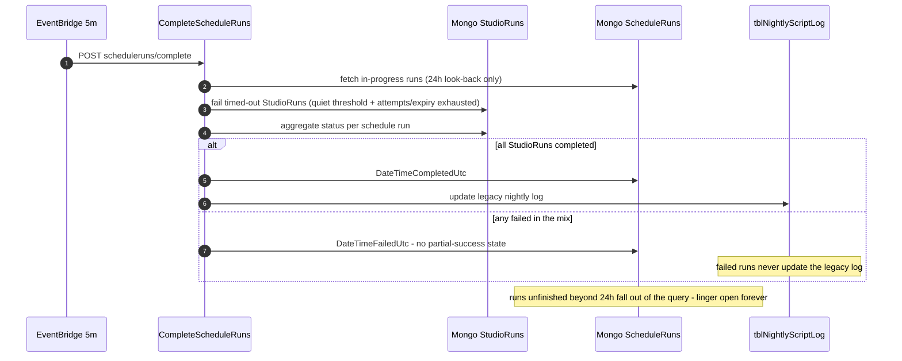

Anchors: `ScheduleRunService.cs:561-629` · `StudioRunProvider.cs:334-405` · `ScheduleRunProvider.cs:222-260`.

### S19 · Legacy batch ACH settlement (MON/OP only)

`StatusCode=6` `'FTP Batch Created'` is written **only** for Method=3 on Moneris/Optimal (`inc_run_eft.asp:2468-2470`) — there is no FTP/NACHA code anywhere in the modern Bank service. Settlement happens in `adm_daily_ach.asp` (`runUpdateACHFTPStatus :912+`): pull returns from `ftpssl.rbc.com`, fund or decline `tblCCTrans`, `returnToAccount` on reject. **The EFT row stays `6` forever** — no `6 → 3` flip exists in the codebase.

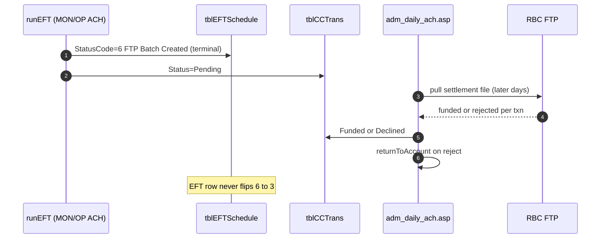

### S20 · Account autopay (Method=2 — no gateway)

Schedule `Method=2` charges the member's **account** (sale payment method `16`): balance check unless `ss_AllowNegativeBalAutoPays` (`inc_run_eft.asp:1890-1899`); on success writes a negative `[PAYMENT DATA]` "Purchase on Account" (ProductID `99`) plus an account debit (`:3093-3162`). Charges above `cltAutoPayLimit` **split**: card/ACH takes `apPayAmtA`, remainder goes to account (`:1567-1570`). On gateway declines, last-retry-day-or-batch + `ss_DeclinedCCToAccount` converts the sale to account instead of deleting it (`WriteToAccount` `:1577` → `returnToAccountWithoutInvoiceRepopulate` `:2452-2456`). Account and declined-to-account sales earn **no rewards** (`:3172-3173`).
