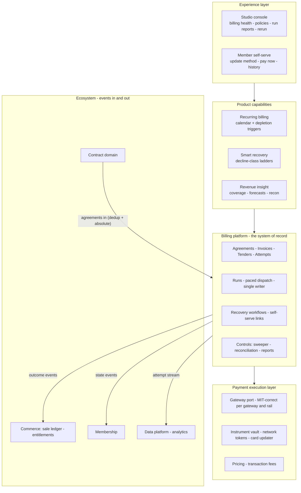
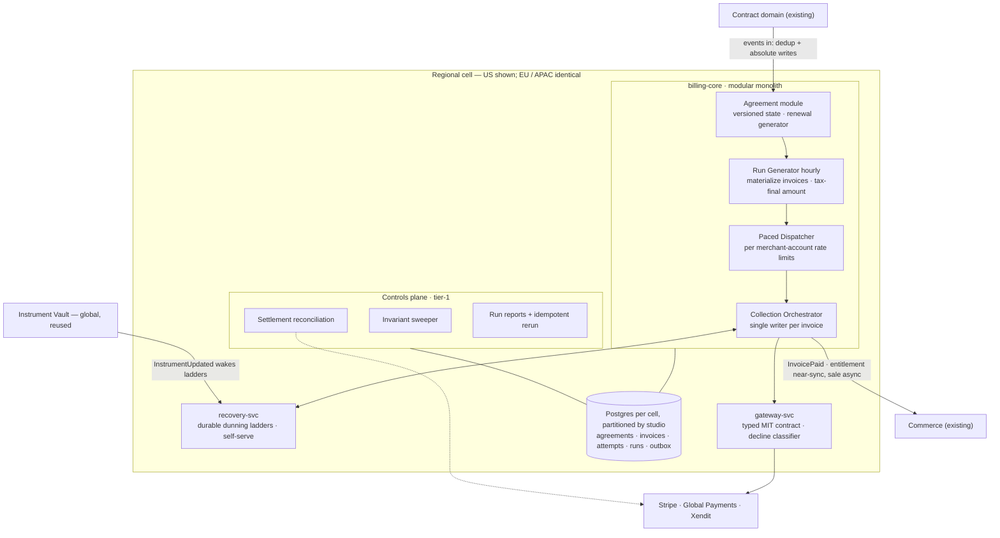
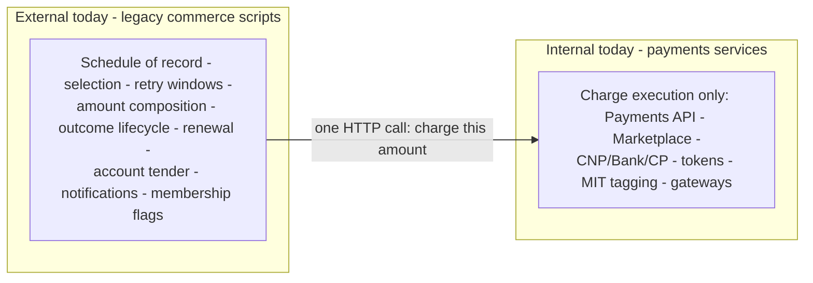
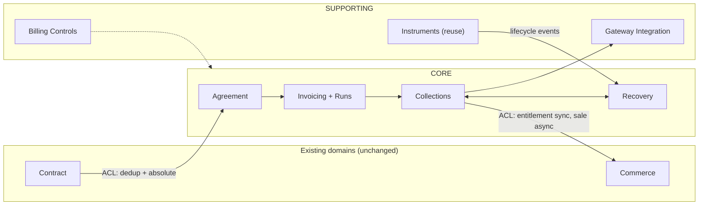
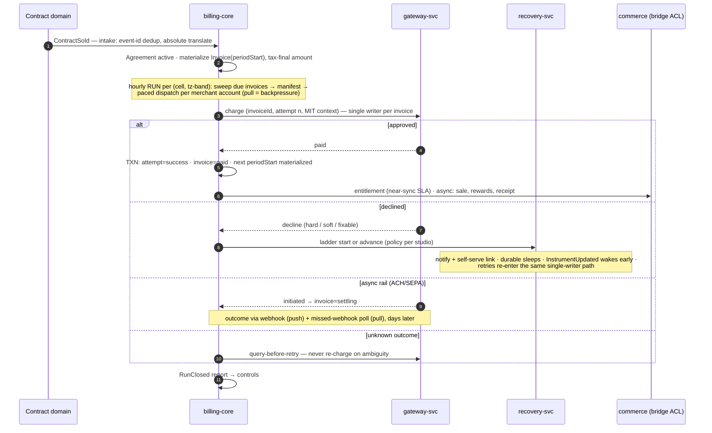

# AutoPay — Rewrite Target Architecture (HLD)

> Synced 2026-08-31 from the local working copy; canonical Notion links below.

> Companion to the existing-system HLD on Notion: https://app.notion.com/p/3c2dda30e231815789b0f09e1b17ca99
> Existing E2E flows (S1–S13): https://app.notion.com/p/3c2dda30e2318117b6f7ee8181f11abd
> Designed 2026-08-20 as a from-first-principles complete rewrite; grounded in the code-verified existing-system HLD.

**Scope.** Replace the recurring-billing engine (legacy nightly ASP + `tblEFTSchedule` row-scanning) with a purpose-built billing platform. Covers all current product capability — card/ACH/wallet autopay, contract-driven schedules, studio-local charge timing, renewals, retry, account-balance conversion, membership flagging, card-updater continuity, staff visibility, ops pause, multi-gateway (Stripe / Global Payments / Xendit) — plus the three capabilities the legacy system never productized: decline-aware dunning, smart retry, member self-serve recovery. Out of scope: commerce (sales ledger, tax rules, rewards engines), contract selling, sunset processors.

## 0. Vision architecture

> **Vision: every membership payment collects itself.** Billing becomes a platform capability — agreements that know when and how much to bill, invoices that carry their own recovery plan, money movement that is MIT-correct on every rail and gateway, and a control plane that proves daily that what was billed is what was collected. Studios configure policy instead of tuning retry-day integers; members recover their own failed payments; commerce consumes outcomes as events; and nobody greps nightly-script logs to find missing revenue.

### The target landscape

### Three horizons

| Horizon | Theme | What ships | Value unlocked |
|---|---|---|---|
| **H1 · Recover** | Recovery island on the legacy engine (Alternative H as sequencing) | recovery-svc with decline-class ladders · decline data liberated from CNP's private Mongo · member self-serve recovery links · notification dedup by design | Attacks the ~$8.5M/mo unrecovered pool and the ~8% dunning coverage without touching the core; ends doomed-auth burn (~52K/mo) |
| **H2 · Own** | Billing platform becomes the system of record, cohort by cohort | billing-core cutover via the existing gate mechanism · tender chains, pause windows, depletion sweep · write-through legacy projection · controls plane (sweeper + settlement reconciliation) | P1–P14 die per migrated cohort; silent non-billing and money limbo become detectable by construction |
| **H3 · Autonomize** | Self-driving revenue operations | `EntitlementDepleted` events from commerce · bought/ML retry timing at scale · portfolio-level revenue insights · ASP engine and legacy projection retired as readers re-point | Billing runs itself; engineers build product, not reconciliation scripts |

### Vision pillars

1. **Autonomous collection** — invoices know their due time, amount, tender chain, and recovery plan; humans set policy, not cadence.
2. **Money-safe by construction** — constraints and single-writer serialization make double-charge, duplicate-cycle, and charged-without-record unexpressible, not merely unlikely.
3. **Decline-intelligent** — every gateway outcome is classified data that changes behavior: hard stops, soft retries smartly timed, fixables routed to the member.
4. **Boundary-clean** — payments owns the promise-to-pay lifecycle (§5c); commerce, membership, and notifications consume events, never interleave with the charge.
5. **Provably reconciled** — the platform's own controls prove coverage and settlement daily; missing revenue is an alarm, not an archaeology project.

### What the vision changes, measurably

| Today (measured) | Vision target |
|---|---|
| Wallet success ~59% vs card ~79% (MIT gap) | Wallet at card parity — MIT-correct on every rail (H2) |
| ~52K doomed auths/mo on hard-terminal cards | ~0 — hard declines never re-auth (H1) |
| ~8% of 869K monthly failures receive any recovery treatment | Every failure enters a ladder; recovery coverage becomes a policy choice, not a gap (H1–H2) |
| ~$15.6M/mo never collected · ~$8.5M/mo declined pool | Material recapture via class-aware ladders + self-serve + instrument wakes (H1–H3) |
| Silent failure modes: non-billing, double-advance, poison loss, lingering runs | Detectable by construction — sweeper + reconciliation + coverage reports (H2) |

---

## 1. Existing system architecture (reference)

The existing system is documented separately — this doc references it instead of duplicating it:

- AutoPay — High-Level Design (Existing System): https://app.notion.com/p/3c2dda30e231815789b0f09e1b17ca99 — full architecture (three migration gates, run wrappers, shared `runEFT` engine, Pipeline C), data stores, retry/idempotency semantics, and measured scale.
- AutoPay — End-to-end data-flow scenarios S1–S13: https://app.notion.com/p/3c2dda30e2318117b6f7ee8181f11abd — code-verified walk-throughs of every existing path.

Minimal context: today an autopay is a `tblEFTSchedule` row playing **agreement + invoice + attempt log + retry queue** at once, charged decline-blind through three independent migration gates, with every lane still executing inside legacy `runEFT`. The measured problems this creates are in §2; architecture detail, gate anchors, and scale live in the linked pages above.

## 2. Problem register (grounded in code + data)

| # | Problem | Root cause in existing design | Measured cost |
|---|---|---|---|
| P1 | Decline-blind retry | Decline reason stored as display text; retry = re-scan window | ~52K doomed auths/mo; ~341K/mo vs do-not-retry cards |
| P2 | Wallet success gap | Method-801 lane omits MIT/OffSession tags cards get | ~59% vs ~79% success; 2.5x transaction_not_allowed |
| P3 | Silent schedule double-advance | Relative DATEADD on at-least-once unordered SQS, no dedup | Skipped billing cycles, invisible |
| P4 | Duplicate renewal rows | Blind INSERT on success; no lock, no NOT-EXISTS | Duplicate future charges under overlap |
| P5 | No dunning / self-serve recovery | Give-up is a time window, not a state machine | ~$8.5M/mo unrecovered declined pool |
| P6 | Retry silently disabled | AutoPayRetryDays=0/1 collapses declined re-pick | 2,305 studios / $133.7M scheduled GMV |
| P7 | Ambiguous outcomes need humans | Gateway timeout writes Audit row; no query-back | Manual reconciliation queue |
| P8 | Dual-maintenance drift | Selection SQL in ASP and C#; two charge lanes; parity flags | Ongoing engineering tax |
| P9 | Charging entangled with commerce | runEFT mixes charge, taxes, discounts, rewards, sale writes | Any change risks money and ledger |
| P10 | Row-scan fragility | Retry queue = scan window; missed window = silent age-out | Undetectable non-billing |
| P11 | No financial control loop | No settlement reconciliation, no coverage reports | Errors surface via support |
| P12 | Pipeline C poison loss (found 2026-08-20 deep pass) | No SQS DLQ; message deleted after 3 in-lambda retries (`SqsLambdaBase.cs:148-153`) | Failed contract-date updates silently dropped |
| P13 | Notification spam risk (found 2026-08-20) | Failed-email dedup guard is commented-out dead code (`adm_daily_autopay.asp:880`) | Members can be re-emailed every decline night |
| P14 | Run close-out blind spots (found 2026-08-20) | Close-out scans a 24h window only; no run wall-clock timeout; mixed outcomes = Failed (`ScheduleRunService.cs:561-629`) | Stale runs linger open forever; no partial-success state |

## 3. Design principles

1. **Push for latency, pull for truth** — every fact of record is establishable by a sweep or query; events only accelerate; a lost event costs seconds, never money.
2. **Runs for audit, workflows for recovery, constraints for correctness, projections for coexistence.**
3. **Money state never depends on a peer's availability.**
4. **Every reactive feature names its batch fallback, or it doesn't ship.**
5. **Boring by default** — batch chassis, Postgres constraints, three deployables, reuse the existing instrument vault.

## 4. Domain model — un-collapsing the schedule row

| Entity | Meaning | Key invariant |
|---|---|---|
| BillingAgreement | The promise: terms, frequency, renewal policy, default instrument | Amendments versioned and absolute ("periodStart := X", never relative) |
| Invoice | One installment: tax-final amount frozen at materialization (pre-auth), due timestamp (studio-local) | (agreementId, periodStart) unique — duplicate cycle is a constraint violation |
| CollectionAttempt | One try: tender, MIT context, outcome, decline class | Append-only; ≤1 success **per tender slot** (single writer + unique index); invoice `paid` only when the tender chain covers the full amount |
| PaymentInstrument | Tokenized method (existing vault, reused) | Emits lifecycle events; billing never sees a PAN |

Invoice states: `scheduled → collecting → paid | settling | dunning → recovered | written_off | canceled` — `settling` models async rails (ACH/SEPA/BECS) where initiation and outcome are days apart. Agreement states: `active | paused | past_due | disputed | canceled | completed`.

Invoices materialize just-in-time (next cycle only), with tax and final amount computed at materialization — before any auth. Future dates shown to staff/members are a read projection, not rows.

### 4a. Domain upgrades from the exhaustive existing-system audit (2026-08-20)

The S14–S20 deep pass exposed four live product behaviors the v1 model under-specified; now first-class:

1. **Tender, not just instrument.** An attempt collects via a **tender**: a gateway instrument (card/bank/wallet) **or the member's account balance** (no gateway — today's Method=2, S20). Invoices carry an **ordered tender chain** set by policy: card up to a cap + account remainder (today's `cltAutoPayLimit` split), or decline → account fallback (`DeclinedCCToAccount`) expressed as a *collection step*, not a write-off side effect. ≤1-success holds per tender slot; the attempt ledger records which tender paid. A partially covered invoice is **not** `paid` — it carries its residual into dunning, and recovery collects the residual only. Pause-fee and cycle invoices coexist in one period, so invoice identity is `(agreementId, periodStart, kind: cycle | pause_fee)`.
2. **Two billing triggers: calendar and depletion.** Calendar agreements materialize by `periodStart`. **Depletion agreements** (today's dormant count-series, S16) materialize on an `EntitlementDepleted` event from commerce — replacing the legacy NULL-`ScheduleDate` wake — with the nightly sweep as pull backstop. Sweeper invariant refined: *active agreement ⇒ exactly one open invoice **or** a live trigger subscription.*
3. **Pause windows** (today's contract suspensions, S15): scheduled start/end on the agreement; auto-resume shifts future `periodStart`s by the pause duration; optional **pause fees** are policy-defined invoices inside the window; early unsuspend is an amendment.
4. **Amount composition at materialization** = base + prorations + **discounts computed against live state** (e.g. membership-referral) + **transaction fees** (Pricing `v2/payment-method/fees`, reused) + tax — all frozen pre-auth. JIT materialization keeps time-varying discounts honest.

**Principal-review caveats (2026-08-20 second pass):** (a) live-state discounts put commerce data on the **pre-charge critical path** — discounts compute from a billing-owned **replicated read model** refreshed ahead of runs; staleness *delays* materialization (safe), never misprices (unsafe). (b) `EntitlementDepleted` does not exist upstream today — at v1 the nightly depletion **sweep is the mechanism**; the event is a later commerce optimization, not a dependency.

## 5. Target architecture, bounded contexts and services

### 5a. Architecture at a glance

### 5b. Bounded contexts and service catalog

> Full deep-dive on Notion: AutoPay Rewrite — Bounded Contexts & Services — https://app.notion.com/p/3c2dda30e23181b3800cc7217cbd8c98 (context map with DDD relationship types, 7 contexts with invariants, 7-service catalog with split triggers, canonical events, flows F2–F7). Summary retained below for offline reference.

**Gateway-svc requirements sharpened by ground truth (2026-08-20):** recurring context mapped **per gateway** — Stripe `OffSession`/`mit_exemption`/NTI · GlobalPayments `stored_credential` (Initiator=Merchant, Sequence=Subsequent) + `BrandReference`=NTI · Xendit passthrough; **NTI persistence per instrument** moves into gateway-svc; capture mode explicit per adapter (Xendit ignores `Capture` today); **per-rail mandates** (SEPA/BACS/BECS/NzBECS) stored and attached on every subsequent charge — closing the EU-rails gap for all gateways.

### 5c. Payment-domain boundary — what moves inside, what moves outside

**Today the boundary sits at "who talks to the gateway."** Internal to payments is **execution only**: the charge API (`Mindbody.Api.Payments`), gateway dispatch (Marketplace + `Map.PaymentProcessing`), the processors with MIT tagging and gateway selection (CNP/Bank/CardPresent), tokenization (Instruments + vault), the orchestration shell (runs, suspension, fee endpoints), and Pricing — plus two things *trapped* inside: decline classification (CNP's private Mongo `Declines`) and NTI persistence. Everything that **decides, prices, retries, and records** payment outcomes is external — inside legacy `runEFT`/Web.Scripts: the schedule of record (`tblEFTSchedule`), due-row selection and retry windows, amount composition (tax + referral discounts at charge time), the outcome lifecycle (status codes, renewal, give-up), the account tender and decline-to-account conversion, member notifications, membership flagging, and batch-ACH settlement. The boundary is one HTTP call: commerce-side code decides everything and asks payments to "move this amount."

**The target redraws the boundary at "who owns the promise-to-pay."** Five responsibilities move **inward** to the billing platform:

| Responsibility | Today (external, in ASP) | Target (internal to billing) |
|---|---|---|
| Schedule of record | `tblEFTSchedule` in commerce SQL | Agreement + Invoice in billing-core Postgres; legacy table becomes a write-through projection |
| Retry / give-up policy | `AutoPayRetryDays` scan windows | Recovery ladders — decline-class aware, validated policy objects |
| Amount finalization | Composed at charge time inside `runEFT` | Frozen at materialization: discounts via billing-owned read model, fees via Pricing, tax pre-auth (§4a.4) |
| Outcome lifecycle | Status codes + renewal + limbo states (`4`) in one function | Invoice state machine, T1-atomic; renewal constraint-guarded; F8 for async returns |
| Decline intelligence | Trapped in CNP Mongo, analytics-only | First-class attempt data driving recovery ladders |

And four responsibilities `runEFT` performs today move (or stay) **outward**, behind explicit ACLs:

| Responsibility | Today (inline in `runEFT`) | Target (external, behind ACL) |
|---|---|---|
| Sale / ledger recording | `Sales`, `[Sales Details]`, `tblPayments` written inline | Commerce-bridge: entitlement near-sync (T2), ledger async (T3) — full legacy pipeline at v1 |
| Entitlements | `[PAYMENT DATA]` inserts inline | Commerce grants on `InvoicePaid`; clawback on F8 |
| Membership state | `UpdateMembershipToDeclined` called mid-decline | Membership consumes `past_due` / `written_off` events |
| Notifications, rewards, receipts | `wsSendMail` inline, errors swallowed | Recovery-ladder steps with idempotency keys; platform delivery |

Two boundary calls made deliberately: the **instrument vault stays a separate payments-platform service** (reused — billing never sees a PAN), and the **account balance stays commerce-owned** — billing treats it as a *tender* it commands via the bridge (§4a.1), never owning the member's ledger.

**In one line:** payments grows from a charge executor into a billing platform; commerce keeps everything that happens *because* money moved — consuming events instead of being interleaved line-by-line with the charge.

| Deployable | Contains | Owns data | Split trigger |
|---|---|---|---|
| billing-core | Agreement, Invoicing, Collections + intake ACL, commerce-bridge ACL, controls modules | Postgres per regional cell (US/EU/APAC), partitioned by studio: agreements, invoices, attempts, runs, outbox | >1 team on core; recon vs OLTP interference |
| recovery-svc | Dunning ladders (durable workflows), per-studio policies, self-serve sessions | Workflow state | Day-1 separate: different runtime + failure profile |
| gateway-svc | Typed gateway port + Stripe/GP/Xendit adapters, decline classifier | Adapter config, pending-reconciliation queue | PCI isolation; per-gateway scaling |

Context-map relationships: Contract → Agreement is upstream/downstream with ACL; Collections → Commerce is downstream via ACL; gateway adapters are conformist per vendor; Recovery ↔ Collections is a partnership. The gateway port's request type **requires** recurring context (MIT tags / network-transaction chain / mandate) on every off-session charge.

## 6. Master flow and canonical flows

Canonical flows: **F1** golden path (above) · **F2** decline → ladder → recovered (degraded mode: recovery down ⇒ declined invoices stay run-eligible) · **F3** hard decline / exhaustion → write-off, optional balance conversion, membership flag · **F4** contract change → absolute amendment, open invoice re-materialized, replays no-op · **F5** instrument updated → wake ladder now, else next charge reads current token · **F6** chargeback → agreement disputed, collection paused, entitlement reversed · **F7** pause/resume at three gates (run generation, dispatch, orchestrator), resume drains through paced dispatcher · **F8** async-rail return/clawback — a `settling` invoice whose rail reports a return moves to `dunning` with `class: bank_return`; entitlement granted at initiation is **clawed back** via the bridge; `settling` past the banking horizon is a sweeper violation. No charged-with-errors limbo (legacy `StatusCode=4`): money state completes in T1; commerce failures are bridge retries.

## 7. Interaction model (pull vs push, sync tiers)

| Tier | Rule | Members |
|---|---|---|
| T1 atomic | Same transaction; async forbidden | attempt-success ↔ invoice-paid ↔ next-period materialization; frozen amount ↔ charge; idempotency check ↔ dispatch |
| T2 near-sync | Async mechanics, seconds SLA, alarmed | entitlement on payment; self-serve charge result; legacy-projection write-through |
| T3 async | Minutes–days | sale/rewards/receipts, notifications, ladders, disputes, reconciliation, sweeps |

Pull (truth): run sweeps, invariant sweeps, settlement reconciliation, missed-webhook polls, contract anti-entropy compare, read projections. Push (latency): contract events in, declines → ladders, instrument wakes, webhooks, paid → bridge. Every push edge has a mandatory pull backstop; push never chains HTTP-to-HTTP (always outbox → queue).

## 8. Correctness and controls

| Invariant | Enforced by |
|---|---|
| ≤1 successful attempt per tender slot; invoice `paid` ⇔ chain covers full amount | Single writer per invoice + unique index per slot; residual tracked on the invoice |
| No duplicate cycle | (agreementId, periodStart) uniqueness |
| No double-advance from upstream replays | Event-id dedup + absolute writes at intake |
| Charged amount = invoiced amount incl. tax | Amount frozen at materialization, pre-auth |
| Active agreement ⇒ exactly one open invoice | Invariant sweeper (continuous, paged) — silent non-billing detectable by construction |
| No dangling settling | Settlement-horizon check (e.g. 5 banking days) |
| DB money == gateway money | Daily settlement reconciliation per merchant account; deltas auto-open work items |
| Every declined invoice laddered or terminal | Recovery sweep |
| Async-rail returns always land (F8) | `settling → returned → laddered` + entitlement-clawback event; banking-horizon sweep backstops missed webhooks |
| Depletion agreements never stall dormant | Trigger subscription per dormant agreement; nightly sweep backstops missed `EntitlementDepleted` events |

The controls plane (sweeper, reconciliation, run reports with idempotent rerun) is a tier-1 deliverable in v1.

## 9. How the target solves the problem register

| Problem | Mechanism in target | Kind of fix |
|---|---|---|
| P1 decline-blind retry | Decline classifier at gateway port; per-class ladders; bought Smart Retries on Stripe | Structural |
| P2 wallet MIT gap | Typed charge contract requires recurring context | Unexpressible |
| P3 double-advance | Intake ACL: event-id dedup + absolute writes | Unexpressible |
| P4 duplicate renewal | Next cycle materialized in the paid TXN under periodStart uniqueness | Constraint |
| P5 no dunning/self-serve | Recovery context: ladders, notifications, signed self-serve links, instrument wakes | New capability |
| P6 retry foot-gun | Policies are validated objects with bounds, not raw integers | Validation |
| P7 audit rows | Query-before-retry on unknown outcomes; settling state for async rails | Automated reconciliation |
| P8 dual maintenance | One selection (run sweep), one charge path, one owner per context | Consolidation |
| P9 charge/commerce entanglement | Commerce behind ACL; entitlement T2, ledger T3 | Boundary |
| P10 scan fragility | Runs report covered set; invariant sweeper detects absence | Detection by construction |
| P11 no control loop | Controls plane is a v1 deliverable | New capability |
| P12 Pipeline C poison loss | Intake via outbox → queue with DLQ; absolute writes; contract anti-entropy sweep as pull backstop | Structural |
| P13 notification spam | Notifications are recovery-ladder steps with per-step idempotency keys — dedup by design, not by flag column | Structural |
| P14 close-out blind spots | No look-back windows: invariant sweeper (active agreement ⇒ exactly one open invoice) + run coverage reports | Detection by construction |

## 9a. Coverage audit vs the full flow inventory (2026-08-20)

| Existing flow | Covered by |
|---|---|
| S14 failed-payment notification (dedup dead code) | Ladder steps with per-step idempotency keys (P13); notify/receipt parity is a named bridge requirement |
| S15 suspension with scheduled end + pause fees | Pause windows (§4a.3): auto-resume date-shift, pause-fee invoices, early-unsuspend amendment |
| S16 count-series wake (usage-triggered billing) | Depletion trigger (§4a.2) + refined sweeper invariant |
| S17 staff rerun / manual runs / ForceRetry | Idempotent rerun commands in controls; per-invoice recollect re-enters single-writer path |
| S18 close-out blind spots | P14: invariant sweeper + run coverage reports — no look-back windows |
| S19 legacy batch ACH (MON/OP, StatusCode=6) | Sunset with processors — replaced by `settling` + F8; never ported |
| S20 account autopay + split + decline→account | Tender chains (§4a.1): account balance is a first-class tender |
| Wallet + EU-rails MIT gaps | Per-gateway recurring-context mapping + per-rail mandates in gateway-svc |
| Legacy-ACH webhook blindness / Bank always-Pending | Webhook (push) + poll (backstop) + banking-horizon sweep; `settling` first-class |
| Referral discounts, fees, taxes inside runEFT | Amount composition at materialization (§4a.4), frozen pre-auth |
| Sale composition: receipts, rewards, unpaids, class stats | Bridge invokes the full legacy sale pipeline at v1 (parity list from S-pass) |
| Charged-with-errors (StatusCode=4) limbo | Impossible by tiering: money state T1-atomic; commerce failures are bridge retries |

## 10. Alternatives considered (decision record)

| Option | Shape | Outcome |
|---|---|---|
| A · Domain services + per-invoice timers | Event-driven state machines, timer per invoice | Rejected as chassis: due-times cluster (studio-local nights) so timers hide the batch; most self-built machinery. Kept: the domain model |
| B · Durable workflows everywhere (Temporal/SFN) | Every invoice = long-running workflow | Rejected globally: millions of open workflows, versioning burden. Kept as the Recovery island — ladders are workflow-shaped; batch fallback keeps it reversible |
| C · Batch billing-run chassis | Set-based runs, paced dispatch, run reports | **Chosen chassis**: structural auditability/reconciliation, shortest credible path, team heritage |
| D · Buy (Stripe Billing / Zuora / Chargebee) | SaaS owns subscription state | Rejected pure: 20K+ merchants-of-record breaks SaaS platform model; multi-gateway unsupported. Kept hybrid: buy retry-timing intelligence where Stripe is the gateway |
| E · Event sourcing as primary | All state = projections over events | Rejected as paradigm: tax on every future engineer. Kept locally: append-only attempts ledger + outbox |
| Microservices-first topology | 7+ deployables | Rejected: volume is small for partitioned Postgres. Chosen: 3 deployables with named split triggers |
| Incremental strangler (no rewrite) | Keep extracting from ASP seams | Viable, analyzed separately; preserves legacy semantics (P1, P4, P5, P10). Its gate mechanism is reused for cutover |
| F · Engine swap, store stays (added 2026-08-20 second pass) | Keep `tblEFTSchedule` as system of record; rewrite only the engine | Serious contender: every existing reader keeps working natively — the legacy-projection layer (risk #5) disappears. Rejected as primary: four-roles-in-one-row persists, attempts/policies need side tables anyway, P4/P10 only mitigated. **Kept as the fallback posture** if the projection proves unownable |
| G · Evolve `Mindbody.Payments.AutoPay` into the engine | Add invoice/attempt/recovery inside the existing modern service | Lowest activation energy (orchestration, ledgers, APIs, org trust exist). Rejected as identity: run-centric shape recreates two-truths internally. **Kept pragmatically**: billing-core may live in this repo/team — the boundary that matters is the domain model, not the deployment unit |
| H · Recovery-first overlay (do less) | No core rewrite: build only Recovery/dunning on today's engine via ForceRetry/manual machinery | Strongest "do you need a rewrite" challenger — attacks the ~$8.5M/mo pool cheaply. Rejected as end-state: decline class is trapped in CNP Mongo (CNP changes needed anyway); P3/P4/P10/P12 stay unfixed. **Adopted as sequencing**: recovery island ships first, against the legacy engine |

**Decision triggers:** projection unownable → fall back to **F**; no capacity for a new deployable → build billing-core inside AutoPay per **G** (domain model unchanged); program cut to one quarter → ship **H** only and stop.

## 11. Migration and coexistence

Per-studio cutover via the runtime gate mechanism the organization already operates: **backfill** (agreements from contract tables + open schedule rows; in-flight declines enter ladders at an equivalent step) → **no-charge shadow run** (selection + amount parity vs legacy pick) → **flip** money movement → monitor. A **write-through legacy projection** keeps `tblEFTSchedule`-shaped rows current so every existing report, staff screen, and downstream reader works unchanged until individually re-pointed — owned as a product for the duration. No dual-charging validation exists; parity + first-cohort monitoring is the honest method. Cohort order: single-location, MBPS-only, no-rewards studios first; 20 years of contract variants (FirstAPFree, month-to-month conversions, paused contracts) are budgeted as per-cohort backfill rules.

## 12. Open decisions and top risks

1. **Commerce bridge scope — ANSWERED 2026-08-20 (repos cloned and verified):** there is **no modern sale-recording API**. `Mindbody.Sales` is read + carts/checkout, but checkout persists via the legacy Subscriber API (`CartsRepository.cs:326-333`) and autopay origins are explicitly excluded from checkout (`PaymentEventProcessorService.cs:52-61`); Sales' only autopay role is observe-only integrity validation reading `tblEFTSchedule`. Consequence: the commerce-bridge must write back through the legacy sale path at v1 — named owner required; a known cost now, not an uncertainty. Partial reuse confirmed: `Mindbody.Pricing` `v2/payment-method/fees` is the modern fee engine — ASP already calls it via AutoPay API `autopay-fees/calculate` (`inc_run_eft.asp:3485-3486` → `PricingApiClient.cs:10`).
2. **Workflow platform** for recovery (Temporal Cloud vs Step Functions vs minimal built ladder) — decide on ops capacity; reversible via batch fallback.
3. **Entitlement timing on async rails** — grant on initiation vs settlement; proposed default: cards immediate, ACH on initiation with clawback on return. Either way the clawback mechanics are **F8** (now canonical); forced by ground truth: Bank always answers `Pending` and returns arrive via webhooks/polling days later (`BankService.cs:149-155`).
4. **Backfill fidelity tail** — bounded by cohort gating, never zero.
5. **Two truths for years** — the legacy projection must have an owner or coexistence rots (fallback if unownable: Alternative **F**).
6. **Commerce read model for discounts** (second pass) — materialization needs billing-owned replicas of discount inputs; staleness policy: delay, never misprice.
7. **Depletion signal** (second pass) — v1 runs on the depletion sweep; `EntitlementDepleted` is a commerce roadmap item, not a dependency.

---

*One line: pull guarantees, push accelerates, transactions protect the money, runs make it auditable, projections keep the old world alive until it isn't needed.*
